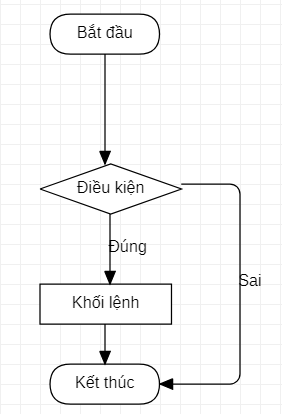

<center>

# Welcome To Java

</center>

## 1. Ngôn ngữ Java là gì, lí do ra đời của Java?

---

- Java là một trong những ngôn ngữ lập trình hướng đối tượng được sử dụng phổ biến trong phát triển phần mềm, trang web, ...
- Java được tạo ra nhằm viết phần mềm cho nhiều sản phẩm: **Write once, run anywhere**.

## 2. Cách Jave hoạt động, điều gì xảy ra khi chạy code Java?

---

### 2.1 Cách Java hoạt động

- Java là loại ngôn ngữ **vừa thông dịch, vừa biên dịch**.
- Khi viết mã, hệ thống tạo ra một tệp .java. Khi biên dịch mã nguồn của chương trình sẽ được biên dịch ra mã byte code. Máy ảo Java (Java Virtual Machine) sẽ thông dịch mã byte code này thành machine code  (hay native code) khi nhận được yêu cầu chạy chương trình.

| Ưu điểm                                 | Nhược điểm  |
| --------------------------------------- | ----------- |
| Chạy được trên nhiều nền tảng khác nhau | Tốc độ chậm |

### 2.2 Điều gì xảy ra khi chạy code Java

- Khi chạy code Java, Java không chạy trực tiếp như C hay Python mà trải qua hai gia đoạn chính: Biên dịch (compile) -> Thực thi (run)
- Khi chạy chương trình ".java" trình biên dịch "javac" sẽ kiểm tra syntax và biên dịch thành bytecode -> sinh ra file ".class"
- Sau đó máy ảo JVM sẽ thông dịch hoặc biên dịch chương trình thành mã máy để có thể chạy.

## 3. Cấu trúc một chương trình Java

---

- **Case-Sensitivity** (Phân biệt chữ hoa, chữ thường): Java là ngôn ngữ phân biệt chữ hoa – chữ thường. Điều này có nghĩa là cú pháp, từ khóa phải viết đúng kiểu chữ mà ngôn ngữ yêu cầu. Ví dụ, lệnh `System.out.println()` phải viết đúng như vậy — nếu bạn gõ `system.out.println()` hay `System.Out.println()`, trình biên dịch sẽ không hiểu bạn đang muốn dùng System hoặc out.
- **Comments** (Chú thích): Đây là chú thích dòng đơn (single-line comment). Trình biên dịch sẽ bỏ qua mọi thứ sau // cho đến cuối dòng. Chú thích dùng để ghi chú, giải thích mã mà không ảnh hưởng đến hoạt động của chương trình.
```java
// This program outputs the message "Hello World!" to the monitor
```
- **Classes** (Lớp)
    - Tất cả chương trình Java ít nhất có một lớp.
    - Tên lớp phải trùng với tên file (ở đây file là `HelloWorld.java`, lớp tên `HelloWorld`).
    - Theo quy ước, các từ trong tên lớp được viết hoa chữ cái đầu (Pascal Case).
    - Dấu ngoặc nhọn `{` và `}` định nghĩa phạm vi (scope): mọi thứ nằm giữa nó là phần của lớp.
```java
public class HelloWorld { 
  // class code
}
```
- **Methods** (Phương thức):
    - Mỗi chương trình Java bắt buộc có phương thức `main()`.
    - Phương thức là một tập hợp các câu lệnh thực hiện một nhiệm vụ cụ thể.
    - Trong trường hợp này, `main()` là điểm khởi đầu để chương trình bắt đầu chạy.
```java
public static void main(String[] args) {
    // Các câu lệnh
}
```
- **Statements** (Câu lệnh):
    - Đây là một câu lệnh vì nó thực hiện một thao tác (in ra dòng chữ).
    - `println()` là phương thức dùng để xuất ra màn hình dòng văn bản “Hello World!”.
    - `out` là đối tượng (object) trong `System` chịu trách nhiệm đầu ra.
    - Dấu chấm `.` (dot notation) dùng để truy cập thành phần (phương thức hoặc thuộc tính) của đối tượng.
    - Mỗi câu lệnh Java kết thúc bằng dấu chấm phẩy `;`.
```java
System.out.println("Hello World!");
```
- **Whitespace** (Khoảng trắng): Trong Java, bạn có thể dùng khoảng trắng (khoảng cách, tab, dòng mới) để làm mã dễ đọc hơn. Trình biên dịch sẽ bỏ qua khoảng trắng khi thực thi. Do đó, bạn nên dùng khoảng trắng để thụt lề, ngắt dòng, chia đoạn để mã dễ theo dõi và bảo trì.
## 3.1 Package
---

- Khái niệm: **Package trong Java** được sử dụng để nhóm các lớp liên quan. Hãy nghĩ về nó như một thư mục trong một thư mục tập tin. 

- **Các Package có sẵn trong Java API**
Chúng ta sử dụng các gói để tránh xung đột tên và để viết mã có thể bảo trì tốt hơn. Các gói được chia thành hai loại:
- Package tích hợp (gói từ API Java)
- Package do người dùng xác định
- Package trong Java API

Các Package được sử dụng phổ biến và tích hợp sẵn trong Java bao gồm:
- **Java.lang**: Package được import tự động, chứa các lớp hỗ trợ ngôn ngữ. Ví dụ các kiểu dữ liệu nguyên thủy, hoặc phép toán.
- **Java.util**: Bao gồm các lớp tiện ích, thực hiện cấu trúc dữ liệu: danh sách liên kết, hoạt động date/time
- **Java awt**: Bao gồm các class triển khai thành phần cho giao diện sử dụng đồ hoại, có thể là: button, menu…
- **Java.io**: là các lớp chỗ trợ IN/OUTPUT (I/O)
- **Java.net**: Bao gồm các lớp để hỗ trợ thao tác network
- **Java.applet**: Bao gồm các lớp để tạo Applet

## 4. Syntax cơ bản
---

### 4.1 Khai báo biến nguyên thủy
- #### Biến Là Gì?
    - Biến (variable) là một **vùng nhớ** được đặt tên, dùng để lưu trữ dữ liệu. Bạn có thể coi biến như một chiếc hộp, trong đó bạn có thể cất giữ các giá trị khác nhau.
    - Trong Java, bạn cần khai báo biến trước khi sử dụng, bằng cách chỉ định kiểu dữ liệu và tên biến:
    `kieu_du_lieu ten_bien;`
    - Hoặc, bạn có thể khai báo và khởi tạo biến cùng một lúc:
    `kieu_du_lieu ten_bien = gia_tri;`

    **Ví dụ:**
    ```java
    int age;           // Khai báo biến age có kiểu int (số nguyên)
    String name = "Alice"; // Khai báo và khởi tạo biến name có kiểu String (chuỗi)
    double pi = 3.14;    // Khai báo và khởi tạo biến pi có kiểu double (số thực)
    boolean isStudent = true; // Khai báo và khởi tạo biến isStudent có kiểu boolean (true/false)
    ```
- #### Kiểu Dữ Liệu Nguyên Thủy Trong Java
| **Kiểu dữ liệu** | **Mô tả**                         | **Kích thước** | **Phạm vi giá trị**                                      | **Ví dụ**               |
| ---------------- | --------------------------------- | -------------- | -------------------------------------------------------- | ----------------------- |
| `byte`           | Số nguyên 8-bit                   | 1 byte         | -128 đến 127                                             | `byte b = 10;`          |
| `short`          | Số nguyên 16-bit                  | 2 byte         | -32,768 đến 32,767                                       | `short s = 1000;`       |
| `int`            | Số nguyên 32-bit                  | 4 byte         | -2,147,483,648 đến 2,147,483,647                         | `int i = 100000;`       |
| `long`           | Số nguyên 64-bit                  | 8 byte         | -9,223,372,036,854,775,808 đến 9,223,372,036,854,775,807 | `long l = 1000000000L;` |
| `float`          | Số thực 32-bit (độ chính xác đơn) | 4 byte         | ±1.4E-45 đến ±3.4028235E+38                              | `float f = 3.14F;`      |
| `double`         | Số thực 64-bit (độ chính xác kép) | 8 byte         | ±4.9E-324 đến ±1.7976931348623157E+308                   | `double d = 3.14159;`   |
| `boolean`        | Giá trị logic (true hoặc false)   | 1 bit          | `true` hoặc `false`                                      | `boolean flag = true;`  |
| `char`           | Ký tự Unicode 16-bit              | 2 byte         | U+0000 đến U+FFFF (0 đến 65,535)                         | `char c = 'A';`         |
- #### 4.2 Vòng Lặp Trong Java
    - Vòng lặp `While`
    ```java
    while (điều_kiện) {
        // Mã thực thi trong vòng lặp
    }
    ```
    - `điều_kiện` là một biểu thức logic trả về `true` hoặc `false`. Khi điều kiện là `true`, code bên trong vòng lặp sẽ được thực thi. Khi điều kiện trở thành `false`, vòng lặp kết thúc.
    - **Ví dụ**
    ```java
    public class VongLapWhile {
        public static void main(String[] args) {
            int i = 1;  // Khởi tạo biến đếm
            while (i <= 5) {  // Kiểm tra điều kiện
                System.out.println("Số: " + i);
                i++;  // Tăng biến đếm lên 1
            }
        }
    }
    ```
    - Vòng lặp `for`
    ```java
    for (khởi tạo; điều kiện; cập nhật) {
        // code thực thi trong vòng lặp
    }
    ```
    - **`khởi tạo`**: Đây là một phần của code được thực hiện một lần duy nhất khi vòng lặp bắt đầu. Thường được sử dụng để khởi tạo biến đếm hoặc thiết lập giá trị ban đầu.
    - **`điều kiện`**: Điều kiện kiểm tra trước mỗi lần lặp. Nếu điều kiện là "true", vòng lặp tiếp tục thực hiện. Nếu điều kiện trở thành "false," vòng lặp kết thúc.
    - **`cập nhật`**: Đây là một phần của code được thực hiện sau mỗi lần lặp. Thường được sử dụng để cập nhật giá trị của biến đếm hoặc điều kiện để tiến tới điều kiện dừng.
    ```java
    public class VongLapForExample {
        public static void main(String[] args) {
            for (int i = 1; i <= 5; i++) {
                System.out.println("Số: " + i);
            }
        }
    }
    ```
- #### 4.3 Câu Lệnh Rẽ Nhánh
    - Cấu trúc `if-else`
    ```java
    if(điều kiện) {
    câu lệnh 1;
    câu lệnh 2;
    câu lệnh 3;
    ...
    };
    else {
    câu lệnh 1;
    câu lệnh 2;
    câu lệnh 3;
    ...
    }

    // hoặc
    if(điều kiện) câu lệnh 1;
    else câu lệnh 1;
    ```
    - Sự hoạt động của `if-else` được mô tả qua sơ đồ khối sau
    
    - Cấu trúc `switch-case`
    ```java
    switch (biểu_thức) {
        case giá_trị_1:
            // Khối mã thực thi
            break;
        case giá_trị_2:
            // Khối mã thực thi
            break;
        // ...
        default:
            // Khối mã thực thi nếu không khớp với case nào
    }
    ```
    - ` biểu_thức `: Là giá trị hoặc biến được so sánh (thường là kiểu int, char, String (từ Java 7), hoặc enum).
    - ` case `: Chỉ định giá trị cụ thể để so sánh với `biểu_thức`.
    - `break`: Thoát khỏi khối switch sau khi thực thi xong một `case`.
    - `default`: Xử lý trường hợp không khớp với bất kỳ `case` nào (tùy chọn).
    

- #### 4.4 Mảng
    ##### 4.4.1 Mảng Một Chiều
    - **Mảng Một Chiều** là một cấu trúc dữ liệu trong lập trình, được sử dụng để lưu trữ một tập hợp các giá trị cùng kiểu dữ liệu. Mảng 1 chiều được đánh chỉ số bắt đầu từ 0 và kích thước của nó được xác định tại thời điểm khai báo.
    - Để khai báo một mảng 1 chiều trong Java, sử dụng cú pháp sau:
    `<kiểu dữ liệu>[] <tên mảng> = new <kiểu dữ liệu>[<kích thước>];`
    **Ví dụ**: khai báo một mảng 1 chiều chứa các số nguyên có 5 phần tử
    ```java
    int[] numbers = new int[5];
    ```
    - Sau khi khai báo, có thể gán giá trị cho các phần tử của mảng bằng cách truy cập vào chỉ số của phần tử đó trong mảng. Ví dụ:
    ```java
    numbers[0] = 1;
    numbers[1] = 2;
    numbers[2] = 3;
    numbers[3] = 4;
    numbers[4] = 5;
    ```
    *Các Phương Thức Hỗ Trợ*

    - **length**: trả về số lượng phần tử trong mảng.
    - **sort**: sắp xếp các phần tử trong mảng theo thứ tự tăng dần.
    - **toString**: trả về một chuỗi đại diện cho mảng.
    *Ví dụ*
    ```java
    int[] numbers = {5, 2, 8, 1, 9};
    int length = numbers.length; // trả về 5
    Arrays.sort(numbers); // sắp xếp mảng theo thứ tự tăng dần
    String str = Arrays.toString(numbers); // trả về chuỗi "[1, 2, 5, 8, 9]"
    ```
    ##### 4.4.2 Mảng Hai Chiều
    - **Mảng 2 chiều** trong Java là một mảng có kích thước nhiều hơn so với mảng 1 chiều. Mảng 2 chiều có thể được coi như một bảng (hay một ma trận) với các phần tử được sắp xếp trong các hàng và cột. Mỗi phần tử trong mảng 2 chiều được truy cập thông qua chỉ số của hàng và cột.
    - Cách khai báo
    `dataType[][] arrayName = new dataType[rowSize][colSize];`
    Trong đó:
    - **dataType** là kiểu dữ liệu của các phần tử trong mảng.
    - **arrayName** là tên của mảng.
    - **rowSize** là kích thước của hàng (số lượng phần tử trong hàng) trong mảng 2 chiều.
    - **colSize** là kích thước của cột (số lượng phần tử trong cột) trong mảng 2 chiều.
    Ví dụ, để khai báo một mảng 2 chiều có kích thước 3 hàng x 4 cột với kiểu dữ liệu là int, ta có thể sử dụng đoạn code sau:
    ```java
    int[][] arr = new int[3][4];
    ```
    Một số phương thức hữu ích khi làm việc với mảng 2 chiều trong Java bao gồm:
    - **length**: trả về kích thước của mảng.
    - **clone()**: tạo một bản sao của mảng.
    - **equals()**: so sánh hai mảng với nhau.
    *Ví dụ:*
    ```java
    int[][] arr1 = {{1, 2}, {3, 4}};
    int[][] arr2 = {{1, 2}, {3, 4}};
    if (Arrays.deepEquals(arr1, arr2)) {
        System.out.println("Hai mảng bằng nhau.");
    }
    ```

## 5. Tổng quan về Class và Object
---

### 5.1 Từ khóa `this`
- `This` trong Java là một tham chiếu đặc biệt, được sử dụng để chỉ đối tượng hiện tại của lớp mà phương thức hoặc hàm tạo đang được gọi. Nói một cách đơn giản, `this` giúp phân biệt giữa các biến `instance` (biến của đối tượng) và các biến cục bộ hoặc tham số có cùng tên. Từ khóa này thường xuất hiện trong các lớp Java khi bạn cần làm rõ ràng ngữ cảnh của đối tượng.
- *Ví dụ, nếu bạn có một lớp với một biến instance và một tham số cùng tên trong hàm tạo, this sẽ giúp bạn xác định rõ biến nào thuộc về đối tượng hiện tại.*
```java
class SinhVien {
    String ten;
    int tuoi;

    SinhVien(String ten, int tuoi) {
        this.ten = ten; // Phân biệt biến instance "ten" và tham số "ten"
        this.tuoi = tuoi;
    }
}
```
*Trong ví dụ trên, `this.ten` tham chiếu đến biến instance của lớp `SinhVien`, còn `ten` là tham số được truyền vào hàm tạo.*

#### Cách sử dụng `this` trong Java
- `This` để phân biệt biến instance và tham số

    - Đây là cách sử dụng phổ biến nhất của `this` trong Java. Khi tên biến instance và tham số hoặc biến cục bộ trùng nhau, `this` được sử dụng để chỉ rõ biến instance của lớp.
    ```java
    class NhanVien {
        String hoTen;

        void setHoTen(String hoTen) {
            this.hoTen = hoTen; // Gán giá trị tham số hoTen cho biến instance hoTen
        }
    }
    ```
    - Trong trường hợp này, `this.hoTen` là biến instance, còn `hoTen` là tham số của phương thức `setHoTen`.
- Gọi hàm tạo khác trong cùng một lớp
    - `This` trong Java cũng có thể được sử dụng để gọi một hàm tạo khác trong cùng một lớp. Điều này giúp tái sử dụng mã và tránh lặp lại logic khởi tạo.
    ```java
    class SanPham {
        String ten;
        double gia;

        SanPham(String ten) {
            this(ten, 0.0); // Gọi hàm tạo khác
        }

        SanPham(String ten, double gia) {
            this.ten = ten;
            this.gia = gia;
        }
    }
    ```
    - Trong ví dụ này, hàm tạo `SanPham(String ten)` gọi hàm tạo `SanPham(String ten, double gia)` bằng cách sử dụng `this`.
- Truyền `this` như một tham số
    - `This` trong Java có thể được truyền như một tham số cho phương thức hoặc hàm tạo khác, thường được sử dụng khi một đối tượng cần truyền chính nó vào một phương thức khác.
    ```java
    class Xe {
        String tenXe;

        Xe(String tenXe) {
            this.tenXe = tenXe;
        }

        void hienThi(Xe xe) {
            System.out.println("Tên xe: " + xe.tenXe);
        }

        void goiHienThi() {
            hienThi(this); // Truyền đối tượng hiện tại làm tham số
        }
    }
    ```
- Trả về đối tượng hiện tại
    - `This` cũng có thể được sử dụng để trả về đối tượng hiện tại từ một phương thức, hỗ trợ kỹ thuật gọi chuỗi phương thức (method chaining).
    ```java
    class TaiKhoan {
        double soDu;

        TaiKhoan napTien(double soTien) {
            this.soDu += soTien;
            return this; // Trả về đối tượng hiện tại
        }

        TaiKhoan rutTien(double soTien) {
            this.soDu -= soTien;
            return this;
        }
    }
    ```
    - Ví dụ trên cho phép gọi chuỗi phương thức như sau:
    ```java
    TaiKhoan tk = new TaiKhoan();
    tk.napTien(1000).rutTien(500);
    ```

### 5.2 Từ khóa `constructor`
- Khái niệm: `Constructor` là một hàm đặc biệt có:
    - Tên trùng với tên lớp.
    - Không có kiểu trả về (kể cả `void`).
    - Dùng để khởi tạo giá trị ban đầu cho các thuộc tính (fields) của đối tượng khi đối tượng được tạo bằng từ khóa `new`.
- Cú pháp `constructor`
```java
class Person {
    String name;
    int age;

    // Constructor
    public Person(String name, int age) {
        this.name = name;
        this.age = age;
    }
}
```
Sử dụng:
```java
Person p = new Person("An", 25);
```
- Các loại `constructor` trong Java
    -
    - Default Constructor (Constructor mặc định)
    Nếu không tự định nghĩa `constructor`, Java tự động tạo một constructor không tham số:
    ```java
    class Animal {
        // Java tự động tạo constructor này:
        // public Animal() {}
    }
    ```
    - No-Argument Constructor (Constructor không tham số)
    ```java
    public Animal() {
        System.out.println("A new animal is created!");
    }
    ```
    - Parameterized Constructor (Constructor có tham số)
    ```java
    public Animal(String name) {
        this.name = name;
    }
    ```
- Các loại Access Modifier trong Java
    - 
| **Access Modifier**      | **Trong cùng lớp** | **Cùng package** | **Khác package (kế thừa)** | **Khác package (không kế thừa)** |
| ------------------------ | ------------------ | ---------------- | -------------------------- | -------------------------------- |
| `public`                 | Y                  | Y                | Y                          | Y                                |
| `protected`              | Y                  | Y                | Y                          | N                                |
| (default) (không ghi gì) | Y                  | Y                | N                          | N                                |
| `private`                | Y                  | N                | N                          | N                                |
- Giải thích từng loại
    - `public`: Truy cập mọi nơi — không bị giới hạn package hay lớp.
    ```java
    public class Student {
        public String name;   // Ai cũng truy cập được
        public void showName() {
            System.out.println(name);
        }
    }
    ```
    - `protected`: Chỉ truy cập được trong cùng package, hoặc từ lớp con (subclass) ở package khác.
    ```java
    class Animal {
        protected void makeSound() {
            System.out.println("Some sound");
        }
    }

    class Dog extends Animal {
        void bark() {
            makeSound();  // OK vì là lớp con
        }
    }
    ```
    - (default) — hay còn gọi là package-private
    ```java
    class Car {              // default class
        String brand;        // default field
        void printBrand() {  // default method
            System.out.println(brand);
        }
    }
    ```
    - `private`: Truy cập được chỉ trong cùng lớp — không nơi nào khác (kể cả lớp con).
    ```java
    public class Person {
        private int age;

        private void showAge() {
            System.out.println(age);
        }

        public void printAge() {
            showAge(); // OK, vì cùng lớp
        }
    }
    ```
- `getter` trong Java
    -
    - `getter` là một phương thức (method) dùng để lấy giá trị của thuộc tính (biến thành viên) trong một lớp (class).
    - Trong Java, các thuộc tính của lớp thường để `private` để đảm bảo tính đóng gói (encapsulation) – một nguyên lý của OOP -> Muốn xem phải thông qua `getter`
    - Cấu trúc một `getter`
    ```java
    public <kiểu_dữ_liệu> get<TênBiến>() {
        return this.<tênBiến>;
    }
    ```
    Quy ước đặt tên:
    - Bắt đầu bằng get
    - Sau đó là tên biến với chữ cái đầu viết hoa
    ```java
    public class Student {
        private String name;
        private int age;
        // Constructor
        public Student(String name, int age) {
            this.name = name;
            this.age = age;
        }
        // Getter cho name
        public String getName() {
            return name;
        }
        // Getter cho age
        public int getAge() {
            return age;
        }
    }
    ```
    Sử dụng:
    ```java
    public class Main {
        public static void main(String[] args) {
            Student s = new Student("An", 20);
            System.out.println(s.getName()); // "An"
            System.out.println(s.getAge());  // 20
        }
    }
    ```
- `setter` trong Java
    -
    - `setter` là một phương thức (method) trong Java dùng để gán giá trị (thay đổi dữ liệu) cho một thuộc tính (field) của đối tượng.
    - Trong Java, ta thường khai báo biến là `private` để ẩn dữ liệu nội bộ của đối tượng -> Không thể truy cập trực tiếp từ bên ngoài, nên cần `setter` để thay đổi giá trị một cách an toàn và có kiểm soát.
    - Cấu trúc một `setter`
    ```java
    public void set<TênBiến>(<KiểuDữLiệu> <tênBiến>) {
        this.<tênBiến> = <tênBiến>;
    }
    ```
    Quy ước đặt tên:
    - Bắt đầu bằng set
    - Sau đó là tên biến, chữ cái đầu viết hoa.
    ```java
    public class Student {
        private String name;
        private int age;
        // Setter cho name
        public void setName(String name) {
            this.name = name;
        }
        // Setter cho age
        public void setAge(int age) {
            if (age > 0) {  // kiểm tra hợp lệ
                this.age = age;
            }
        }
    }
    ```
    Sử dụng:
    ```java
    public class Main {
        public static void main(String[] args) {
            Student s = new Student();
            s.setName("ProPTIT");
            s.setAge(14);
        }
    }
    ```
- `static` trong Java
    -
    - Từ khóa static trong Java dùng để định nghĩa thành phần chung (shared) cho mọi đối tượng của một lớp.
    ```java
    public class Student {
        String name;
        static String school = "PTIT";
    }
    ```
    - Biến `static` được chia sẻ giữa tất cả các đối tượng của lớp.