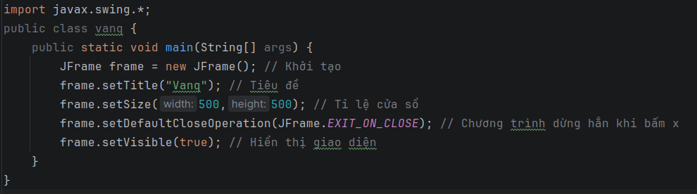
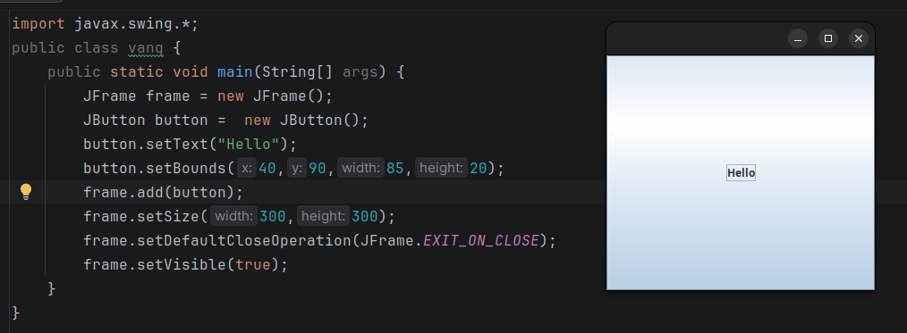
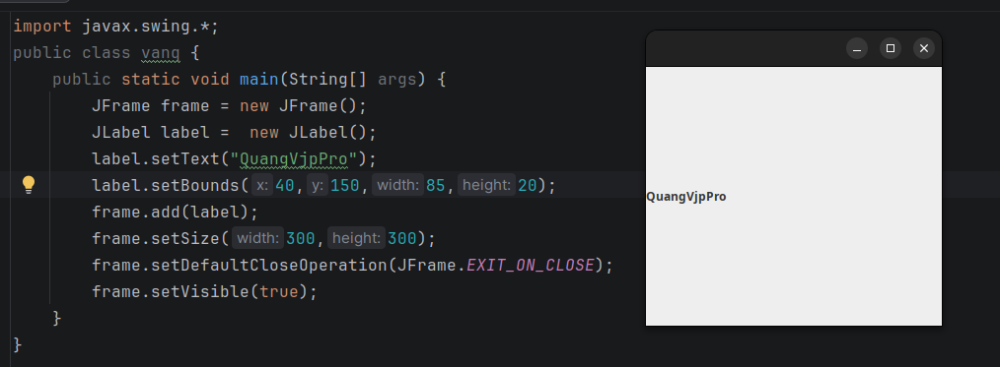
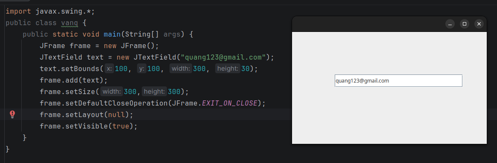
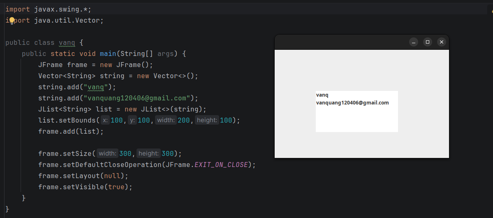

<center>

# [JAVA] - BUỔI 10 (FINAL): Thư viện đồ hoạ Swing + JavaFX
</center>

## A. Java Swing
### I. Thư viện đồ hoạ Swing cơ bản
- **Java Swing** là một bộ thư viện (GUI Toolkit) dùng để xây dựng giao diện người dùng đồ họa cho các ứng dụng desktop. Dù hiện nay có JavaFX hiện đại hơn, nhưng Swing vẫn cực kỳ phổ biến vì tính ổn định, nhẹ và có hàng tấn tài liệu hỗ trợ.

### II. Một số Component cơ bản: JFrame, JButton, JLabel, JTextField, JTable, JList
**1. JFrame - Khung**
- Trong Swing, mọi thứ đều bắt đầu từ các Container (vật chứa) và các Component (thành phần giao diện).
- **Top-Level Containers**: Là cửa sổ chính của ứng dụng (thường là `JFrame`).
- Chức năng: Chứa thanh tiêu đề, nút thu nhỏ, phóng to và đóng cửa sổ.

Lưu ý: Luôn nhớ gọi `setDefaultCloseOperation(JFrame.EXIT_ON_CLOSE)` nếu không ứng dụng vẫn sẽ chạy ngầm sau khi đóng cửa sổ.



**2. JButton – Nút bấm**
- Thành phần tạo ra sự tương tác. Khi người dùng click, nó sẽ kích hoạt một sự kiện (Event).
- Việc sử dụng `ActionListener` sẽ dẫn đến một số hành động khi nút được nhấn.



**3. JLabel – "Nhãn dán thông tin"**
Dùng để hiển thị văn bản hoặc hình ảnh mà người dùng **không thể chỉnh sửa trực tiếp**.
- Ứng dụng: Đặt tên cho các ô nhập liệu (ví dụ: "Tên đăng nhập:").



**4. JTextField – "Ô nhập liệu một dòng"**
Cho phép người dùng nhập một dòng văn bản ngắn.
- Ứng dụng: Nhập tên, số điện thoại, email.



**5. JTable – "Bảng dữ liệu chuyên nghiệp"**
Dùng để hiển thị dữ liệu theo dạng hàng và cột (giống như Excel).

**6. JList – "Danh sách lựa chọn"**
Hiển thị một danh sách các mục để người dùng chọn một hoặc nhiều mục.



### III. BorderLayout, FlowLayout, GridLayout
**1. BorderLayout (Mặc định của JFrame)**
`BorderLayout` chia vùng chứa thành 5 khu vực: North, South, East, West và Center.
- Đặc điểm: * Các vùng North/South giữ nguyên chiều cao, thay đổi chiều rộng.
- Các vùng East/West giữ nguyên chiều rộng, thay đổi chiều cao.
- Vùng **Center** sẽ chiếm toàn bộ không gian còn lại.

**2. FlowLayout (Mặc định của JPanel)**
`FlowLayout` xếp các thành phần giống như cách ta viết chữ: từ trái sang phải, từ trên xuống dưới.
- Đặc điểm: * Giữ nguyên kích thước ưu tiên (Preferred Size) của Component.
- Căn lề: Bạn có thể chỉnh FlowLayout.LEFT, CENTER, hoặc RIGHT.

**3. GridLayout (Dạng lưới ô cờ)**
`GridLayout` chia vùng chứa thành các ô có kích thước bằng chèn chẹt nhau.
- Đặc điểm: * Bạn định nghĩa số hàng và số cột (ví dụ: 3 hàng, 2 cột).
- Ứng dụng: Cực kỳ phù hợp để làm bàn phím máy tính (Calculator) hoặc các form nhập liệu đồng nhất.

### IV. Graphics2D, Image
**1. Graphics2D**
- `Graphics2D` là phiên bản nâng cấp của lớp `Graphics` cơ bản. nó cho phép bạn kiểm soát cực chi tiết về đường nét, màu sắc, độ trong suốt và phép biến hình (xoay, thu phóng).
- **Cách sử dụng**: Bạn không khởi tạo nó trực tiếp mà thường "mượn" nó từ phương thức `paintComponent` của một `JPanel`.
- Các lệnh cơ bản:
    - drawRect(), fillRect(): Vẽ hình chữ nhật (rỗng/đặc).
    - drawOval(), fillOval(): Vẽ hình tròn/bầu dục.
    - setStroke(): Thay đổi độ dày của nét vẽ.
    - setPaint(): Đổ màu gradient hoặc hoa văn.

Ví dụ code vẽ một hình tròn màu xanh:
```java
@Override
protected void paintComponent(Graphics g) {
    super.paintComponent(g);
    Graphics2D g2d = (Graphics2D) g; // Ép kiểu sang Graphics2D
    g2d.setColor(Color.BLUE);
    g2d.setRenderingHint(RenderingHints.KEY_ANTIALIASING, RenderingHints.VALUE_ANTIALIAS_ON); // Làm mượt nét vẽ
    g2d.fillOval(50, 50, 100, 100); 
}
```

**2. Image**
- Image / ImageIcon: Dùng để hiển thị ảnh lên `JLabel` hoặc `JButton` một cách nhanh chóng.
- BufferedImage: Đây là một "mảng điểm ảnh" nằm trong bộ nhớ. Bạn có thể can thiệp vào từng pixel của nó (ví dụ: làm mờ ảnh, đổi màu ảnh sang trắng đen).

**3. Cách chèn và vẽ ảnh lên Giao diện**

Cách A: Dùng JLabel (Đơn giản nhất)

Phù hợp để làm logo hoặc icon tĩnh.

```java
ImageIcon icon = new ImageIcon("path/to/your/image.png");
JLabel label = new JLabel(icon);
```

Cách B: Vẽ bằng Graphics2D (Linh hoạt nhất)

Dùng khi bạn muốn ảnh di chuyển (làm game) hoặc muốn cắt cúp ảnh theo ý muốn.

```java
// Trong phương thức paintComponent
Image img = new ImageIcon("hero.png").getImage();
g2d.drawImage(img, x, y, width, height, this);
```

## B. JavaFX
### I. Cấu trúc giao diện JavaFX
- **Stage (Sân khấu)**: Là cửa sổ chính (Window).
- **Scene (Cảnh)**: Là nội dung hiển thị trong cửa sổ. Một Stage có thể đổi nhiều Scene khác nhau (giống như chuyển từ màn hình Đăng nhập sang màn hình Chính).
- **Scene Graph (Sơ đồ cây)**: Cấu trúc phân cấp của các phần tử giao diện (Nodes).

### II. Các Component cơ bản (Controls)
Đây là các tương tác thực tế mà người dùng chạm vào:
- Label: Hiển thị văn bản tĩnh.
- Button: Nút bấm thực hiện hành động.
- TextField: Ô nhập liệu văn bản một dòng.
- CheckBox: Lựa chọn đúng/sai (có thể chọn nhiều).
- RadioButton: Lựa chọn duy nhất trong một nhóm.

### III. Container: HBox, VBox, BorderPane, GridPane, AnchorPane
- **HBox**: Sắp xếp component theo hàng ngang.
- **VBox**: Sắp xếp component theo hàng dọc.
- **BorderPane**: Tương tự BorderLayout (Top, Bottom, Left, Right, Center).
- **GridPane**: Sắp xếp linh hoạt theo lưới (có thể gộp ô).
- **AnchorPane**: Định vị component dựa trên khoảng cách với các cạnh của Pane.

### IV. Sử dụng SceneBuilder, FXML để lập trình giao diện trong JavaFX
Thay vì phải viết code Java dài dằng dặc để tạo nút bấm, JavaFX cho phép bạn:
- **FXML**: Một file định dạng XML dùng để mô tả giao diện.
- **SceneBuilder**: Công cụ kéo-thả trực quan giúp bạn tạo file FXML mà không cần viết code.
- **Controller**: File Java dùng để xử lý logic (ví dụ: khi bấm nút thì làm gì).

**Quy trình chuẩn:**
Thiết kế giao diện bằng SceneBuilder $\rightarrow$ Lưu thành file .fxml $\rightarrow$ Kết nối với file Controller.java qua @FXML.