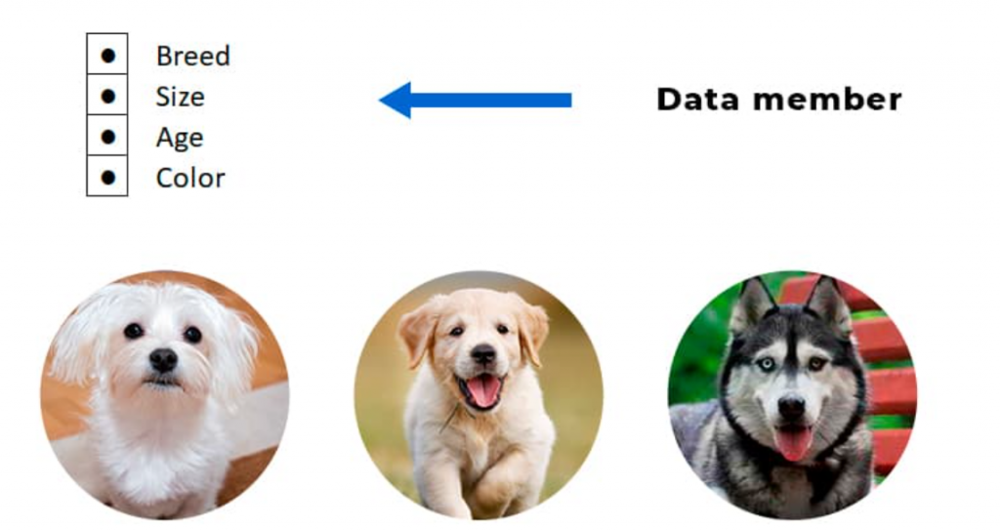
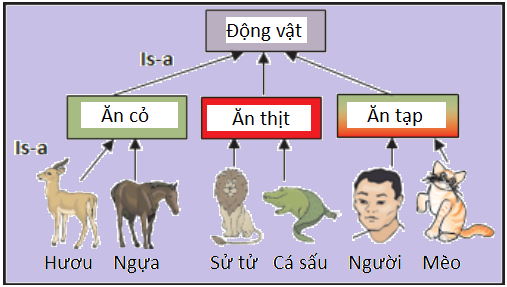

<center>

# Mọi thứ đều là đối tượng
</center>

## I. Tính đóng gói

1. **Tính năng đóng gói trong Java**
- Đóng gói các trường dữ liệu và phương thức của lớp lại với nhau thành một đơn vị duy nhất, đồng thời kiểm soát quyền truy cập vào chúng, tạo ra một lớp an toàn và có thể tái sử dụng.
- Các thành phần nội bộ của lớp sẽ không thể được truy cập từ bên ngoài lớp, trừ khi thông qua các phương thức công khai (public methods).
- Nó ngăn chặn việc truy cập trực tiếp vào các trường dữ liệu của lớp, đảm bảo rằng chúng chỉ có thể được truy cập thông qua các phương thức công khai.

2. **Cách sử dụng tính năng đóng gói trong Java**
- Tính đóng gói có thể được thực hiện thông qua các từ khóa phạm vi truy cập trong Java: `private`, `protected`, `public` và `default` (package-private).
- Từ khóa `private`: Từ khóa `private` giới hạn quyền truy cập chỉ trong lớp hiện tại. Điều này có nghĩa là các thành phần được khai báo với từ khóa `private` chỉ có thể được truy cập từ bên trong lớp đó. Chúng không thể được truy cập từ bên ngoài lớp, kể cả các lớp con của nó.
- Từ khóa `protected`: Từ khóa `protected` giới hạn quyền truy cập chỉ trong lớp hiện tại, các lớp con và các gói con. Điều này có nghĩa là các thành phần được khai báo với từ khóa `protected` có thể được truy cập từ bên trong lớp đó, các lớp con của nó và các lớp trong cùng gói.
- Từ khóa `public`: Từ khóa `public` cho phép quyền truy cập từ bất kỳ lớp nào. Điều này có nghĩa là các thành phần được khai báo với từ khóa `public` có thể được truy cập từ bất kỳ lớp nào, bao gồm cả các lớp ở các gói khác.
- Từ khóa `default` (package-private): Từ khóa `default` (hay còn gọi là package-private) cho phép quyền truy cập từ các lớp trong cùng gói. Điều này có nghĩa là các thành phần được khai báo với từ khóa `default` chỉ có thể được truy cập từ các lớp trong cùng gói, và không thể được truy cập từ bên ngoài gói.

## II. Tính kế thừa

1. **Tổng quan**
- Tính kế thừa là một tính năng cho phép một lớp (class) mới được tạo ra bằng cách sử dụng thông tin và thành phần của một lớp khác.
- Lớp mới (gọi là lớp con) có thể sử dụng các phương thức và thuộc tính đã được định nghĩa trong lớp hiện có (gọi là lớp cha hoặc lớp cơ sở).
- Cú pháp kế thừa trong Java:
**Để kế thừa một lớp trong Java, sử dụng từ khóa `extends`.**
```java
class ParentClass {
    // Các thuộc tính và phương thức của lớp cha
}

class ChildClass extends ParentClass {
    // Các thuộc tính và phương thức của lớp con
}
```
- Đặc điểm của kế thừa trong Java:
    1. **Đơn kế thừa**: Trong Java, một lớp chỉ có thể kế thừa từ một lớp khác duy nhất, không hỗ trợ việc kế thừa từ nhiều lớp (multiple inheritance).
    2. **Truy cập vào thành phần lớp cha**: Lớp con có thể truy cập các thành phần private của lớp cha thông qua các phương thức public hoặc protected được cung cấp bởi lớp cha.
    3. **Ghi đè (Override):** Lớp con có thể ghi đè (override) các phương thức của lớp cha bằng cách cung cấp một triển khai mới của phương thức đó trong lớp con. Điều này cho phép lớp con có hành vi khác biệt hoặc tùy chỉnh từ lớp cha.
    4. **Tính đa hình (Polymorphism):** Kế thừa đi kèm với tính đa hình, cho phép một đối tượng của lớp con có thể được xem như là một đối tượng của lớp cha. Điều này cho phép sử dụng các đối tượng con trong các ngữ cảnh mà yêu cầu các đối tượng cha.
    
**Ví dụ:**
```java
class Animal {
    void sound() {
        System.out.println("Some sound");
    }
}

class Dog extends Animal {
    void sound() {
        System.out.println("Bark");
    }
}

class Cat extends Animal {
    void sound() {
        System.out.println("Meow");
    }
}
```
- Trong ví dụ trên, `Dog` và `Cat` là hai lớp con kế thừa từ lớp `Animal`. Mỗi lớp con có một phương thức `sound` riêng để phản ánh tiếng kêu của chúng, ghi đè phương thức `sound` từ lớp `Animal`.

## III. Upcasting và Downcasting
1. **Upcasting**
- Trong Java, **upcasting** là quá trình chuyển đổi một đối tượng của lớp con thành kiểu của lớp cha trong hệ thống kế thừa. Điều này cho phép chúng ta sử dụng đối tượng lớp con như thể nó là một đối tượng của lớp cha, tận dụng tính đa hình và đơn giản hóa mã nguồn.
- **Upcasting** có thể được thực hiện một cách ngầm định (không cần chỉ định tường minh) hoặc tường minh. Khi **upcasting**, chúng ta chỉ có thể truy cập các phương thức và thuộc tính được định nghĩa trong lớp cha, ngay cả khi đối tượng thực sự là của lớp con.
**Ví dụ:**
```java
class DongVat {
    void keu() {
        System.out.println("Động vật kêu");
    }
}

class Cho extends DongVat {
    void keu() {
        System.out.println("Gâu gâu");
    }
    void can() {
        System.out.println("Chó cắn");
    }
}

public class Main {
    public static void main(String[] args) {
        Cho cho = new Cho();
        DongVat dongVat = cho; // Upcasting ngầm định
        dongVat.keu(); // Kết quả: Gâu gâu
        // dongVat.can(); // Lỗi biên dịch: phương thức can() không được định nghĩa trong lớp DongVat
    }
}
```
- Trong ví dụ trên, đối tượng cho thuộc lớp `Cho` được **upcast** thành kiểu `DongVat`. Khi gọi phương thức `keu()`, phương thức của lớp `Cho` được thực thi do tính đa hình. Tuy nhiên, chúng ta không thể gọi phương thức `can()` thông qua biến `dongVat` vì nó không được định nghĩa trong lớp `DongVat`.

2. **Downcasting**
- Trong Java, **downcasting** là quá trình chuyển đổi một đối tượng từ kiểu lớp cha về kiểu lớp con. Điều này cho phép truy cập các phương thức và thuộc tính đặc trưng của lớp con mà không có trong lớp cha. Tuy nhiên, **downcasting** cần được thực hiện cẩn thận để tránh lỗi trong quá trình thực thi.
**Ví dụ:**
```java
class DongVat {
    void keu() {
        System.out.println("Động vật kêu");
    }
}

class Meo extends DongVat {
    void keu() {
        System.out.println("Meo meo");
    }
    void batChuot() {
        System.out.println("Mèo bắt chuột");
    }
}

public class Main {
    public static void main(String[] args) {
        DongVat dongVat = new Meo(); // Upcasting
        if (dongVat instanceof Meo) {
            Meo meo = (Meo) dongVat; // Downcasting
            meo.keu(); // Kết quả: Meo meo
            meo.batChuot(); // Kết quả: Mèo bắt chuột
        }
    }
}
```
- Trong ví dụ trên, đối tượng `dongVat` được **upcast** từ `Meo` lên `DongVat`. Trước khi thực hiện **downcasting**, chúng ta sử dụng toán tử `instanceof` để kiểm tra xem `dongVat` có phải là `instance` của `Meo` hay không. Nếu đúng, chúng ta tiến hành **downcasting** và gọi các phương thức đặc trưng của lớp `Meo`.

## IV. Class Object
1. **Định nghĩa của Class Object**
- **Gốc của hệ thống phân cấp**: `Object` là lớp gốc (root class) của toàn bộ hệ thống phân cấp các lớp (class hierarchy) trong Java.
- **Kế thừa mặc định**: Mọi lớp khác trong Java, dù bạn tự định nghĩa hay các lớp có sẵn, đều **trực tiếp** hoặc **gián tiếp** kế thừa từ lớp `Object`. Điều này có nghĩa là mọi đối tượng (Object) trong Java đều là một thể hiện của lớp `Object`.
- Cung cấp các phương thức cơ bản: Vì mọi lớp đều kế thừa từ nó, nên mọi đối tượng Java đều có sẵn các phương thức cơ bản được định nghĩa trong lớp `Object`.

2. **Các phương thức quan trọng của Class Object**

| Phương thức                         | Chức năng                                                                                    |
| ----------------------------------- | -------------------------------------------------------------------------------------------- |
| `toString()`                        | Trả về một chuỗi biểu diễn của đối tượng (thường là tên class và mã hash).                   |
| `equals(Object obj)`                | So sánh đối tượng hiện tại với đối tượng khác. Mặc định so sánh địa chỉ bộ nhớ (tham chiếu). |
| `hashCode()`                        | Trả về một giá trị số nguyên (hash code) cho đối tượng.                                      |
| `getClass()`                        | Trả về đối tượng `Class` đại diện cho runtime class của đối tượng này.                       |
| `clone()`                           | Tạo và trả về một bản sao (copy) của đối tượng này.                                          |
| `wait()`, `notify()`, `notifyAll()` | Được dùng để đồng bộ hóa luồng (thread synchronization).                                     |

## V. Tính đa hình
- Đa hình giúp ta có thể sử dụng các đối tượng khác nhau, nhưng có cùng một kiểu dữ liệu, giúp giảm sự lặp lại của code, giúp dễ dàng bảo trì và mở rộng chương trình.
- Là khả năng một đối tượng có nhiều “hình dạng” khác nhau.
- Cùng một phương thức nhưng hành vi khác nhau tùy đối tượng.

## VI. Đa hình compile time và runtime
1. **Đa hình compile time**
- Được thực hiện thông qua việc sử dụng nạp chồng phương thức (method overloading) và nạp chồng toán tử (operator overloading).
    - **Nạp chồng phương thức (Method Overloading)**: Đây là quá trình định nghĩa nhiều phương thức có cùng tên trong một lớp nhưng khác nhau về số lượng tham số, kiểu dữ liệu của tham số hoặc cả hai.
```java
class Calculator {
    int add(int a, int b) {
        return a + b;
    }

    double add(double a, double b) {
        return a + b;
    }
}
```
    - **Nạp chồng toán tử (Operator Overloading)**: Java không hỗ trợ nạp chồng toán tử như một số ngôn ngữ khác như C++, vì vậy bạn không thể định nghĩa các toán tử (+, -, *, /) cho các lớp do người dùng tạo.

2. **Đa hình runtime**
- Được thực hiện thông qua kỹ thuật kế thừa và ghi đè phương thức (method overriding).
    - **Kế thừa (Inheritance)**: Đối tượng con có thể thừa hưởng các thuộc tính và phương thức từ đối tượng cha. Khi một phương thức trong lớp con ghi đè (override) một phương thức trong lớp cha, chúng ta có thể gọi phương thức của lớp con nhưng hành vi được xác định tại runtime sẽ phụ thuộc vào đối tượng được tạo.
```java
class Animal {
    void makeSound() {
        System.out.println("Animal makes a sound");
    }
}

class Dog extends Animal {
    void makeSound() {
        System.out.println("Dog barks");
    }
}

class Cat extends Animal {
    void makeSound() {
        System.out.println("Cat meows");
    }
}
```
    - **Ghi đè phương thức (Method Overriding)**: Đối tượng con cung cấp triển khai mới cho một phương thức đã được định nghĩa trong lớp cha.

## VII. Phân biệt Overload và Override
1. **Overload**
- Khi một lớp có nhiều phương thức cùng tên, nhưng khác nhau về tham số (kiểu dữ liệu, số lượng tham số).
- Trình biên dịch sẽ chọn phương thức phù hợp nhất tại thời điểm biên dịch : số lượng tham số, kiểu dữ liệu của tham số, thứ tự các tham số.
```java
class Calculator{
    int sum(int a, int b){
        return a + b;
    }
    int sum(int a, int b, int c){
        return a + b + c;
    }
    double sum(double a, double b){
        return a + b;
    }
}
public class Demo{
    public static void main(String[] args){
        Calculator c = new Calculator();
        System.out.println(c.add(2, 3));   // 5     
        System.out.println(c.add(2, 3, 4)); // 9    
        System.out.println(c.add(2.5, 3.6));  // 6.1  
    }
}
```
2. **Override**
- Override cho phép lớp con thay đổi cách thực hiện của phương thức được định nghĩa trong lớp cha
- Điều kiện là cùng tên, cùng danh sách tham số, cùng kiểu trả về hoặc trả về kiểu con, Access modifier phải cùng hoặc to hơn
- Khi ghi đè, luôn nên dùng @Override để: Compiler kiểm tra bạn có thực sự ghi đè đúng không, Giúp người đọc hiểu rõ ý định.

```java
class Animal{
    public void sound(){
        System.out.println("Animall!!!");
    }
}
class DucAnh extend Animal{
    @Override
    public void sound(){
        System.out.println("Gau Gau!");
    }
}
public class Demo{
    public static void main(String[] args){
        DucAnh hoan = new DucAnh();
        hoan.sound(); // Gau Gau!
    }
}
```