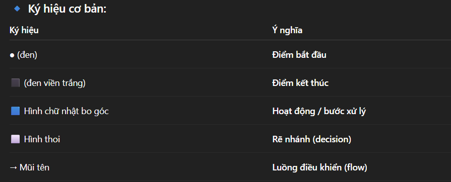

<center>

# Lập Trình Không Chỉ Là CODE 
</center>

## Nội dung tài liệu
1. **Version Control là gì và tại sao cần dùng nó?**
2. **Các khái niệm về Git: Repository, Branch, Commit, Merge, Rebase, gộp commit, Pull, Push, Clone, Fork, Pull Request, Gitignore.**
3. **Khi nào cần Pull Request? Cách tạo Pull Request.**
4. **Resolve conflict khi merge pull request.**
5. **UML là gì?**

## I. Version Control là gì và tại sao cần dùng nó ?
1. **Định nghĩa Version Control**
- **Version Control (Hệ thống quản lý phiên bản)** là một công cụ hoặc phương pháp giúp theo dõi, quản lý và kiểm soát các thay đổi trong mã nguồn hoặc tài liệu theo thời gian.
- Nói đơn giản, nó giúp bạn lưu lại lịch sử làm việc, quay lại các **phiên bản trước đó**, và làm việc nhóm hiệu quả mà không sợ “đè code” của nhau.
1. **Khái niệm cơ bản**
- Ghi lại mọi thay đổi trên tập tin (mã nguồn, tài liệu, cấu hình...).
- Cho phép so sánh, phục hồi hoặc kết hợp các phiên bản khác nhau.
Hỗ trợ làm việc nhóm thông qua việc chia nhánh (branch), gộp nhánh (merge).

2. **Tại sao phải dùng Version Control**

| **Lý do**                             | **Giải thích**                                                              |
| ------------------------------------- | --------------------------------------------------------------------------- |
| **Theo dõi lịch sử thay đổi**         | Biết ai thay đổi gì, khi nào, và tại sao (qua commit history).              |
| **Phục hồi dễ dàng**                  | Quay lại phiên bản trước nếu có lỗi hoặc mất dữ liệu.                       |
| **Làm việc nhóm hiệu quả**            | Nhiều người có thể cùng sửa code mà không ghi đè nhau (branch & merge).     |
| **Tạo môi trường thử nghiệm an toàn** | Có thể thử tính năng mới trên branch riêng, không ảnh hưởng đến code chính. |
| **Minh bạch và kiểm soát chất lượng** | Dễ dàng review code, theo dõi tiến trình phát triển.                        |

## II. Các khái niệm về Git: Repository, Branch, Commit, Merge, Rebase, gộp commit, Pull, Push, Clone, Fork, Pull Request, Gitignore.

1. **Repository (Repo) – Kho chứa mã nguồn**
- Là nơi lưu trữ **toàn bộ mã nguồn** và **lịch sử thay đổi** (commit history) của dự án.
- Có 2 loại:
    - **Local repository**: nằm trên máy cá nhân.
    - **Remote repository**: nằm trên máy chủ (GitHub, GitLab, v.v.).
**Ví dụ**
```sql
git init        # Tạo repo mới trên máy
git clone URL   # Sao chép repo từ GitHub về
```

2. **Branch – Nhánh làm việc**
- Là đường phát triển độc lập trong repo.
- Cho phép phát triển tính năng mới mà không ảnh hưởng đến mã chính (main hoặc master).
```csharp
git branch new-feature    # Tạo nhánh mới
git checkout new-feature  # Chuyển sang nhánh đó
git switch new-feature    # (lệnh mới, tương đương checkout)
```

3. **Commit – Ghi lại thay đổi**
- Mỗi commit giống như một “bản chụp (snapshot)” của code tại thời điểm đó.
- Commit có:
    - Mã định danh duy nhất (SHA hash)
    - Thông điệp mô tả thay đổi
**Ví dụ**
```sql
git add .                        # Chọn file cần commit
git commit -m "Thêm trang đăng nhập"
```

4. **Merge – Hợp nhất nhánh**
- Dùng để gộp thay đổi từ một nhánh vào nhánh khác.
- Nếu có thay đổi trùng, Git sẽ yêu cầu bạn giải quyết conflict (xung đột).
```sql
git checkout main
git merge new-feature
```

5. **Rebase – Cập nhật lịch sử nhánh**
- Cũng dùng để **kết hợp thay đổi**, nhưng bằng cách **chuyển toàn bộ commit** của nhánh này lên đầu commit mới nhất của nhánh khác.
- Giúp lịch sử Git thẳng và gọn hơn (không chia nhánh zigzag).
**Ví dụ**
```cpp
git checkout new-feature
git rebase main
```

6. **Gộp commit (Squash) – Gom nhiều commit thành một**
- Khi bạn có nhiều commit nhỏ lặt vặt (“fix typo”, “chỉnh màu nút”), bạn có thể squash để giữ lịch sử gọn gàng.
**Ví dụ (dùng interactive rebase):**
```shell
git rebase -i HEAD~3
# rồi chọn 'squash' cho các commit bạn muốn gộp
```

7. **Pull – Lấy và cập nhật code mới**
- Kéo (pull) các thay đổi mới nhất từ remote về local và tự động merge.
- Tương đương: **git fetch + git merge**.
**Ví dụ**
```css
git pull origin main
```

8. **Push – Gửi code lên remote**
- Sau khi commit xong ở local, bạn đẩy (push) lên GitHub để chia sẻ với mọi người.
**Ví dụ**
```cpp
git push origin new-feature
```

9. **Clone – Sao chép repo**
- Dùng để tải toàn bộ repo (bao gồm lịch sử commit) từ remote về máy bạn.
**Ví dụ**
```bash
git clone https://github.com/user/project.git
```
10. **Fork – Tạo bản sao repo của người khác**
- Khác với clone: fork là sao chép repo sang tài khoản của bạn trên GitHub.
- Thường dùng để:
    - Đóng góp vào dự án mã nguồn mở (open source)
    - Làm bản riêng để phát triển độc lập
- Sau khi fork, bạn có thể clone bản của mình về máy.

11. **Pull Request (PR) – Yêu cầu hợp nhất code**
- Dùng trên nền tảng như GitHub/GitLab:
- Sau khi push code lên nhánh của bạn, bạn gửi pull request để nhóm xem xét và merge vào nhánh chính.
- Giống như nói: “Tôi đã hoàn thành phần này, hãy review và gộp vào dự án chính.”

12. .gitignore – Danh sách file cần bỏ qua
- Là file đặc biệt để loại trừ các file không cần theo dõi (như file build, cache, password, .env…).

## III. Khi nào cần Pull Request? Cách tạo Pull Request.
1. **Khi nào cần tạo Pull Request?**
- Pull Request dùng khi bạn không được phép merge trực tiếp hoặc muốn đồng đội xem xét trước khi gộp code.

2. **Quy trình tạo Pull Request**
- **Bước 1**: Tạo nhánh riêng để làm việc
```bash
git checkout -b feature/login
# Thực hiện code, commit thay đổi
git add .
git commit -m "Thêm chức năng đăng nhập"
```
- **Bước 2**: Đẩy nhánh đó lên remote
```bash
git push origin feature/login
```
- **Bước 3**: Tạo Pull Request trên GitHub
    - Vào repository trên GitHub.
    - Sẽ thấy nút “Compare & pull request” (GitHub tự nhận ra bạn vừa push nhánh mới).
    - Nhấn vào đó → Màn hình tạo PR xuất hiện.

- **Bước 4**: Điền thông tin Pull Request
    - Base branch: nhánh đích muốn merge vào (thường là main hoặc develop).
    - Compare branch: nhánh của bạn (feature/login).
    - Title: tiêu đề ngắn gọn, ví dụ: "Thêm chức năng đăng nhập người dùng"
    - Description: mô tả chi tiết thay đổi

- **Bước 5**: Gửi Pull Request
    - Nhấn “Create pull request”.
    - PR sẽ xuất hiện trong danh sách.

## IV. Resolve conflict khi merge pull request.
1. **Xung đột (Conflict) là gì?**
- Conflict xảy ra khi Git không thể tự động gộp (merge) hai nhánh vì cùng một đoạn mã đã bị chỉnh sửa khác nhau.

2. **Khi nào conflict xảy ra?**
- Cùng sửa một dòng: Cả hai nhánh cùng thay đổi dòng 50 trong `demo.java`.
- Xóa / đổi tên file: Một nhánh xóa file, nhánh kia sửa file đó.
- Sửa cùng phần nội dung khác nhau

3. **Cách resolve conflict**
Cách 1: Resolve trực tiếp trên GitHub (đơn giản nhất)
    - Vào Pull Request trên GitHub.
    - GitHub báo: “This branch has conflicts that must be resolved”
    - Nhấn “Resolve conflicts”.
    - GitHub hiển thị các file xung đột → bạn chọn phần code cần giữ, xóa các dấu <<<<<<<, =======, >>>>>>>.
    - Sau khi chỉnh xong → nhấn “Mark as resolved”.
    - Nhấn “Commit merge” để lưu lại.
    - Merge Pull Request bình thường.

Cách 2: Resolve conflict trên máy local
```bash
# 1. Lấy code mới nhất từ nhánh main
git checkout main
git pull origin main

# 2. Chuyển sang nhánh PR
git checkout feature/login

# 3. Gộp nhánh main vào nhánh của bạn để cập nhật
git merge main
```
- Nếu có conflict, Git sẽ báo cụ thể file nào bị xung đột.
```bash
# 4. Mở file đó, sửa lại thủ công
# (xóa các dấu <<<<<<<, =======, >>>>>>> và giữ lại code bạn muốn)

# 5. Sau khi sửa xong:
git add .
git commit
```
- Sau đó push lại:
```bash
git push origin feature/login
```
-> Pull Request trên GitHub sẽ tự động cập nhật và hiển thị là “No conflicts”.

## V. UML là gì ?
1. **UML là gì?**
- UML (Unified Modeling Language) — tạm dịch là Ngôn ngữ mô hình hóa thống nhất, là một chuẩn quốc tế dùng để mô tả, thiết kế và hình dung hệ thống phần mềm theo hướng đối tượng.
- UML không phải là ngôn ngữ lập trình, mà là ngôn ngữ mô tả (mô hình hóa) giúp bạn biểu diễn ý tưởng, cấu trúc và hành vi của hệ thống.

2. **Khái niệm về UML**
- UML được phát triển bởi Grady Booch, James Rumbaugh và Ivar Jacobson (nhóm “Three Amigos” của Rational Software).
- Được Object Management Group (OMG) chuẩn hóa vào năm 1997.
- UML cung cấp **ký hiệu đồ họa (diagram)** để mô tả các thành phần trong phần mềm, gồm:
    - **Cấu trúc** (class, object, component,…)
    - **Hành vi** (activity, sequence, state,…)
    - Mối quan hệ giữa các phần của hệ thống.

3. **Mô hình Class Diagram (Sơ đồ lớp)**
- Mục đích: Dùng để mô tả cấu trúc tĩnh của hệ thống — tức là các lớp (class), thuộc tính, phương thức, và quan hệ giữa các lớp.
- Thành phần chính: Một lớp (Class) được biểu diễn bằng hình chữ nhật chia làm 3 phần:
```markdown
-------------------------------------
| ClassName                         |
-------------------------------------
| - attribute1 : Type               |
| - attribute2 : Type               |
-------------------------------------
| + method1() : ReturnType          |
| + method2(param: Type) : ReturnType |
-------------------------------------
```
**Ký hiệu:**
`+` : public
`-` : private
`#` : protected

- Các loại quan hệ giữa các lớp:

| Kiểu quan hệ                 | Ý nghĩa                           |     |
| ---------------------------- | --------------------------------- | --- |
| Association                  | Quan hệ giữa các lớp              | ——— |
| Aggregation                  | “Có – nhưng không sở hữu” (has-a) | ◇—— |
| Composition                  | “Có – và sở hữu” (contains)       | ◆—— |
| Inheritance (Generalization) | Kế thừa (is-a)                    | —▷  |
| Dependency                   | Phụ thuộc                         | --→ |

**Ví dụ**
```pgsql
+-------------------+        +-------------------+
| Person |  | Address |
| ------ ||-------------------|
| - name: String    |        | - street: String  |
| - age: int |  | - city: String |
| ---------- ||-------------------|
| + speak()         |        | + getFullAddress()|
+-------------------+        +-------------------+
           ◆
           │ (Composition)
           │
           ▼
```
- **Ý nghĩa**: Một `Person` có một `Address` (nếu xóa `Person`, `Address` cũng mất theo) → composition.

4. **Mô hình Activity Diagram (Sơ đồ hoạt động)**
- Mục đích: Dùng để mô tả luồng công việc (workflow) hoặc quy trình xử lý nghiệp vụ trong hệ thống.

**Ví dụ: Quy trình đăng nhập**
```css
●  →  [Nhập username & password]
     ↓
   [Kiểm tra thông tin]
     ↓
   ┌───[Sai thông tin?]───┐
   │         ↓            │
   │   [Hiển thị lỗi]     │
   │         ↑            │
   └──NO────→[Đăng nhập thành công]→ ⬛
```

## VI. Lý do cần vẽ UML

| Lý do                                       | Giải thích                                                              |
| ------------------------------------------- | ----------------------------------------------------------------------- |
| Hiểu rõ hệ thống                            | Giúp hình dung cấu trúc và hành vi phần mềm trước khi viết code.        |
| Giao tiếp giữa các thành viên               | UML là “ngôn ngữ chung” giữa lập trình viên, BA, tester, và khách hàng. |
| Thiết kế trước khi code                     | Giúp giảm sai sót, tối ưu kiến trúc và tái sử dụng.                     |
| Phân tích và tài liệu hóa                   | UML giúp ghi lại tài liệu thiết kế dễ bảo trì, mở rộng sau này.         |
| Hỗ trợ quy trình phát triển phần mềm (SDLC) | UML dùng trong giai đoạn phân tích, thiết kế, và cả kiểm thử.           |