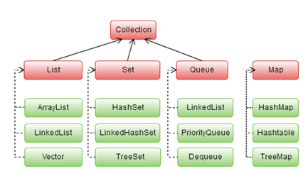
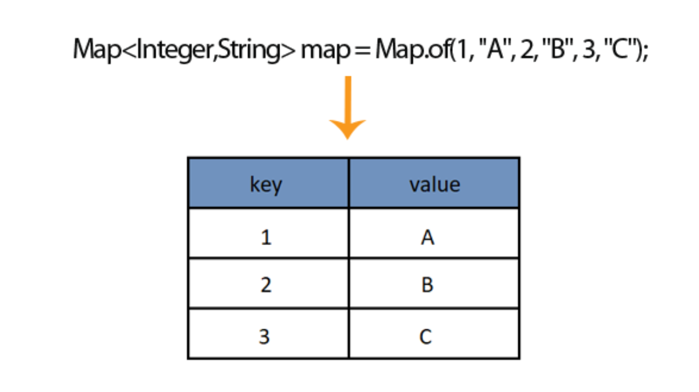
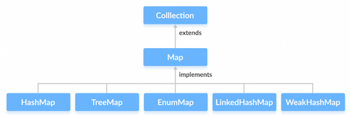
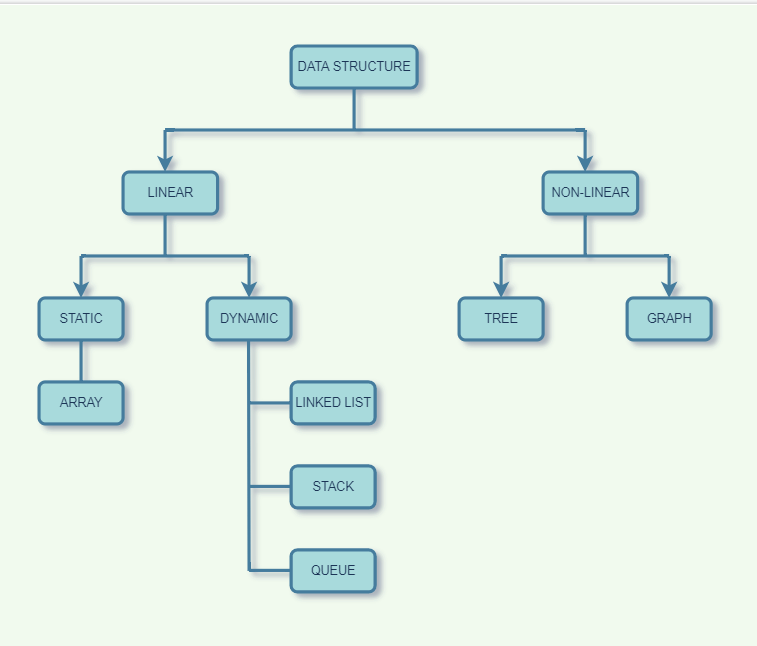

<center>

# BUỔI 7: Một số cấu trúc dữ liệu thường thấy trong Java
</center>

## Nội dung tài liệu
1. **Cấu trúc dữ liệu là gì, sử dụng khi nào?**
2. **Interface Iterable, Collection -> List, Set, Queue**
3. **Định nghĩa một số cấu trúc dữ liệu trong Java:**
    - **Set**
    - **Map**
4. **Sơ đồ kế thừa của các cấu trúc dữ liệu trong Java**
5. **Tại sao trong Java lại có nhiều Collection class, nên chọn class nào để sử dụng?**
6. **Comparable và Comparator, cách sử dụng trong các cấu trúc dữ liệu để sắp xếp**

## I. Cấu trúc dữ liệu là gì, sử dụng khi nào?
- **Cấu trúc dữ liệu (Data Structure)** là cách thức tổ chức, quản lý và lưu trữ dữ liệu trong bộ nhớ máy tính một cách hệ thống, giúp tối ưu hóa việc truy cập, cập nhật và xử lý thông tin. Đây là nền tảng cốt lõi trong lập trình, cho phép sắp xếp dữ liệu (như mảng, danh sách, cây) để các thuật toán hoạt động hiệu quả. 
- Một số ví dụ về cấu trúc dữ liệu:
    - **Mảng (Array)**: Lưu trữ tập hợp các phần tử liên tiếp.
    - **Danh sách liên kết (Linked List)**: Các phần tử liên kết với nhau qua con trỏ.
    - **Ngăn xếp (Stack) & Hàng đợi (Queue)**: Quản lý dữ liệu theo thứ tự LIFO (vào sau ra trước) hoặc FIFO (vào trước ra trước).
    - **Cây (Tree) & Đồ thị (Graph)**: Biểu diễn dữ liệu có mối quan hệ phân cấp hoặc liên kết phức tạp.
    - **Bảng băm (Hash Table)**: Tìm kiếm thông tin cực nhanh. 
- Khi nào sử dụng cấu trúc dữ liệu ?
    - **Cần lưu trữ dữ liệu hiệu quả**: Chọn cấu trúc đúng giúp tiết kiệm bộ nhớ (ví dụ: dùng Array thay cho List khi biết trước số lượng phần tử).
    - **Tối ưu hóa thao tác**: Khi cần tìm kiếm nhanh (Binary Search Tree), sắp xếp (Sorting Algorithms), chèn hoặc xóa phần tử (Linked List).
    - **Xử lý dữ liệu quy mô lớn**: Khi cần quản lý hệ thống dữ liệu phức tạp, cần tính toán và xử lý nhanh chóng, chính xác.
    - **Quản lý luồng dữ liệu**: Sử dụng Stack (ngăn xếp) cho các tác vụ LIFO (vào sau ra trước) hoặc Queue (hàng đợi) cho FIFO (vào trước ra trước). 

## II. Interface Iterable, Collection -> List, Set, Queue
**A. Interface Gốc: Iterable và Collection**
- `Iterable<T>`: Đây là interface cao nhất. Bất kỳ lớp nào triển khai nó đều có thể được duyệt qua bằng vòng lặp **for-each**. Nó chỉ có một phương thức quan trọng nhất là `iterator()`.
- `Collection<E>`: Kế thừa từ Iterable. Đây là interface nền tảng cho tất cả các cấu trúc dữ liệu trong framework (ngoại trừ Map). nó định nghĩa các thao tác cơ bản như `add()`, `remove()`, `size()`, và `clear()`.

**B. Các Interface Con Phổ Biến**
1. **List (Danh sách có thứ tự)**
- `List` lưu trữ các phần tử theo thứ tự thêm vào và cho phép các phần tử trùng lặp. Bạn có thể truy cập phần tử thông qua chỉ số (index).
    - `ArrayList`: Dùng mảng động, truy xuất nhanh ($O(1)$) nhưng thêm/xóa ở giữa chậm.
    - `LinkedList`: Dùng danh sách liên kết kép, thêm/xóa nhanh nhưng truy xuất chậm ($O(n)$).

2. **Set (Tập hợp không trùng lặp)**
- `Set` là một tập hợp các phần tử duy nhất (không chứa 2 phần tử $e1, e2$ sao cho `e1.equals(e2)`).
    - **HashSet**: Không duy trì thứ tự, hiệu suất cực cao cho các thao tác cơ bản.
    - **LinkedHashSet**: Duy trì thứ tự thêm vào.
    - **TreeSet**: Sắp xếp các phần tử theo thứ tự tự nhiên hoặc theo `Comparator`.

3. **Queue (Hàng đợi)**
- `Queue` được thiết kế để giữ các phần tử trước khi xử lý, thường theo nguyên tắc **FIFO** (First-In-First-Out - Vào trước ra trước).
    - **PriorityQueue**: Các phần tử được lấy ra dựa trên độ ưu tiên thay vì thứ tự thêm vào.
    - **Deque (Double Ended Queue)**: Hàng đợi hai đầu, cho phép thêm/xóa ở cả đầu và cuối (như `ArrayDeque`).

Bảng tổng hợp

| Đặc điểm                | List                  | Set                  | Queue                         |
| ----------------------- | --------------------- | -------------------- | ----------------------------- |
| Phần tử trùng lặp       | Cho phép              | Không cho phép       | Cho phép                      |
| Thứ tự                  | Duy trì thứ tự chèn   | Tùy implementation   | Thường là FIFO                |
| Truy cập index          | Có                    | Không                | Không                         |
| Implementation phổ biến | `ArrayList`, `Vector` | `HashSet`, `TreeSet` | `PriorityQueue`, `LinkedList` |

## III. Định nghĩa một số cấu trúc dữ liệu trong Java
**A. Set**
- Set Interface là một loại **Interface Collection**. Khác với `List`, các phần tử trong `List` có thể giống nhau, còn đối với `Set`, các phần tử trong `Set` là duy nhất (nghĩa là giá trị của các phần tử này không được giống nhau). Các phần tử trong `Set` là duy nhất, chúng ta có thể thêm, xóa, sửa các phần tử trong `Set`.


Ví dụ tạo một Set như sau:
```java
import java.util.HashSet;

public class SetExample {
    public static void main(String[] args) {
        Set setA = new HashSet();
        setA.add(element);
        System.out.println( setA.contains(element) );
    }
}
```

Trong ví dụ trên ta tạo ra một tập hợp Set với implementation (lớp thực thi) là HashSet. Ngoài HashSet thì chúng ta có những lớp implementation của Set như sau:
- `EnumSet`
- `HashSet`
- `LinkedHashSet`
- `TreeSet`

**Thêm một phần tử vào `Set`**
- Để thêm một phần tử vào Set ta sử dụng phương thức `add()`. Ví dụ:

```java
import java.util.HashSet;
import java.util.LinkedHashSet;
import java.util.Set;
import java.util.TreeSet;

public class SetExample {
    public static void main(String[] args) {
       Set<String> setA = new HashSet<>();
      setA.add("element 1");
      setA.add("element 2");
      setA.add("element 3");

    }
}
```

- **Duyệt qua các phần tử trong `Set`**
Sử dụng Iterator để duyệt qua các phần tử trong một set. Ví dụ:
```java
Set<String> setA = new HashSet<>();

setA.add("element 1");
setA.add("element 2");
setA.add("element 3");

Iterator<String> iterator = set.iterator();

while(iterator.hasNext()){
  String element = iterator.next();
}
```

Chúng ta cũng có thể sử dụng For Each để duyệt qua các phần tử:
```java
Set set = new HashSet();

for(Object object : set) {
    String element = (String) object;
}
```

- **Xóa một phần tử trong Set**
Chúng ta sử dụng phương thức `remove()` để xóa phần tử trong `Set`. Ví dụ:

```java
set.remove("object-to-remove");
```

- **Xóa tất cả các phần tử trong `Set`**
Để xóa tất cả các phần tử ta sử dụng phương thức `clear()`. Ví dụ:

```java
set.clear();
```

- **Thêm tất cả các phần tử từ một tập hợp `Set` khác**
`Set` cung cấp cho chúng ta phương thức `addAll()` để thêm các phần tử từ một tập hợp khác vào trong `Set`. Ví dụ:

```java
Set<String> set = new HashSet<>();
set.add("one");
set.add("two");
set.add("three");

Set<String> set2 = new HashSet<>();
set2.add("four");

set2.addAll(set)
```

- **Kiểm tra kích thước của `Set`**
Chúng ta sử dụng phương thức `size()` để xem có bao nhiêu phần tử trong Set. Ví dụ:
```java
Set<String> set = new HashSet<>();

set.add("123");
set.add("456");
set.add("789");

int size = set.size();
```java

- **Kiểm tra một phần tử đã tồn tại trong `Set` chưa**
Chúng ta sử dụng phương thức `contains()` để kiểm tra xem phần tử đã tồn tại trong `Set` chưa. Ví dụ:
```java
Set<String> set = new HashSet<>();

set.add("123");
set.add("456");

boolean contains123 = set.contains("123");
```

- **Chuyển tập hợp `Set` thành `List`**
Chúng ta có thể cover một tập hợp `Set` thành `List` bằng phương thức `addAll()`. Ví dụ:
```java
Set<String> set = new HashSet<>();
set.add("123");
set.add("456");

List<String> list = new ArrayList<>();
list.addAll(set);
```

**B. Map**
- Trong java, `map` được sử dụng để lưu trữ và truy xuất dữ liệu theo cặp **khóa (key)** và **giá trị (value)**. Mỗi cặp key và value được gọi là entry.

Map chỉ chứa các giá trị `key` duy nhất, không chứa các `key` trùng lặp.



Các lớp cài đặt (implements) Map interface là:
- **HashMap không đảm bảo thứ tự các entry được thêm vào.**
- **LinkedHashMap đảm bảo thứ tự các entry được thêm vào.**
- **TreeMap duy trình thứ tự các phần tử dựa vào bộ so sánh Comparator.**
- **EnumMap**
- **WeakHashMap**
- **TreeMap**



Sức chứa (capacity) mặc định khi khởi tạo map là `2^4 = 16`. Kích thước này sẽ tự động tăng gấp đôi mỗi khi thêm phần tử vượt quá kích thước của nó.

- **Sử dụng Map trong Java**
Trong Java, chúng ta phải import gói `java.util.Map` để sử dụng `Map`. Khi chúng ta đã `import` gói, sau đây là cách chúng ta có thể tạo `map`.

```java
// Map implementation using HashMap
Map<Key, Value> numbers = new HashMap<>();
```

Trong đoạn code trên, chúng ta đã tạo ra một Map tên là numbers. Chúng ta đã sử dụng `class HashMap` để triển khai `Map interface`. Ở đây:
- `Key` – Code định danh duy nhất được sử dụng để liên kết từng phần tử (value) trong map
- `Value` – các phần tử được liên kết bởi các key trong map

**Các hàm của Map trong Java**
- `put (K, V)` – Chèn liên kết của `key` `K` và `value` `V` vào map. Nếu `key` đã có sẵn, `value` mới sẽ thay thế `value` cũ.
- `putAll`() – Chèn tất cả các mục từ map đã chỉ định vào map hiện tại.
- `putIfAbsent (K,V)` – Chèn liên kết nếu key K chưa được liên kết với value V.
- `get(K)` – Trả về value được liên kết với key K được chỉ định. Nếu không tìm thấy `key`, nó sẽ trả về `null`.
- `getOrDefault(K, defaultValue)` – Trả về value được liên kết với key `k` được chỉ định. Nếu không tìm thấy key, nó sẽ trả về value mặc định.
- `containsKey(K)` – Kiểm tra xem key được chỉ định K đã có trong map chưa.
- `containsValue(V)` – Kiểm tra xem value v được chỉ định đã có trong map chưa.
- `remove(K)` – Xóa mục được đại diện bởi key K khỏi map.
- `remove(K, V)` – Xóa mục có key K liên kết với value V khỏi map.

## IV. Sơ đồ kế thừa của các cấu trúc dữ liệu trong Java


## V. Tại sao trong Java lại có nhiều Collection class, nên chọn class nào để sử dụng?
1. **Tại sao lại có nhiều Collection Class như vậy?**
Mỗi Collection được thiết kế để tối ưu hóa cho một (hoặc vài) thao tác cụ thể dựa trên cấu trúc dữ liệu bên dưới. Sự khác biệt thường nằm ở 3 yếu tố:
- **Thời gian thực thi (Time Complexity)**: Thêm, xóa, tìm kiếm nhanh hay chậm?
- **Thứ tự (Ordering)**: Có giữ đúng thứ tự nhập vào không? Có tự động sắp xếp không?
- **Ràng buộc (Constraints)**: Có cho phép trùng lặp không? Có cho phép giá trị null không?

2. **Cách chọn Collection phù hợp**
**Nhóm List (Khi cần lưu danh sách có thứ tự)**
- **ArrayList**: Là "lựa chọn quốc dân". Dùng khi bạn cần truy cập phần tử theo index cực nhanh ($O(1)$). Tuy nhiên, chèn/xóa ở giữa danh sách sẽ chậm vì phải dịch chuyển các phần tử khác.
- **LinkedList**: Dùng khi ứng dụng của bạn thực hiện chèn và xóa phần tử liên tục ở đầu hoặc cuối danh sách.

**Nhóm Set (Khi không muốn dữ liệu trùng lặp)**
- **HashSet**: Tốc độ nhanh nhất, nhưng thứ tự phần tử sẽ bị xáo trộn ngẫu nhiên.
- **LinkedHashSet**: Giống HashSet nhưng giữ đúng thứ tự bạn đã add vào.
- **TreeSet**: Tự động sắp xếp các phần tử (ví dụ: số từ nhỏ đến lớn, chữ cái A-Z).

**Nhóm Map (Khi lưu dữ liệu dạng Key-Value)**
- ***HashMap***: Phổ biến nhất, truy xuất giá trị qua Key cực nhanh. Không đảm bảo thứ tự.
- **TreeMap**: Key được tự động sắp xếp.
- **ConcurrentHashMap**: Dùng khi bạn làm việc với đa luồng (Multi-threading) để tránh xung đột dữ liệu.

## V. Comparable và Comparator, cách sử dụng trong các cấu trúc dữ liệu để sắp xếp
- **java.lang.Comparable** và **java.util.Comparator** để sắp xếp các đối tượng của lớp tùy chỉnh. Hãy theo dõi một ví dụ đơn giản dưới đây.

```java
package com.journaldev.sort;

import java.util.ArrayList;
import java.util.Arrays;
import java.util.Collections;
import java.util.List;

public class JavaObjectSorting {
    public static void main(String[] args) {
        //sort primitives array like int array
        int[] intArr = {5,9,1,10};
        Arrays.sort(intArr);
        System.out.println(Arrays.toString(intArr));

        //sorting String array
        String[] strArr = {"A", "C", "B", "Z", "E"};
        Arrays.sort(strArr);
        System.out.println(Arrays.toString(strArr));

        //sorting list of objects of Wrapper classes
        List<String> strList = new ArrayList<String>();
        strList.add("A");
        strList.add("C");
        strList.add("B");
        strList.add("Z");
        strList.add("E");
        Collections.sort(strList);
        for(String str: strList) System.out.print(" "+str);
    }
}
```

- Java cho phép sắp xếp các kiểu dữ liệu như `int[]`, `double[]` hoặc `String[]` bằng cách sử dụng các phương thức có sẵn trong lớp `Arrays` hoặc `Collections`. Kết quả cho ra các phần tử đã được sắp xếp theo thứ tự tăng dần:

```java
[1, 5, 9, 10]
[A, B, C, E, Z]
 A B C E Z
```

**Comparable và Comparator trong Java**
**A. Comparable**
- Java cung cấp giao diện Comparable, loại giao diện cần được triển khai bởi lớp tùy chỉnh bất kỳ nếu bạn muốn sử dụng các hàm sắp xếp Array hoặc Collections. Các hàm sắp xếp trong giao diện Comparable sử dụng phương thức compareTo(T obj), bạn có thể kiểm tra bất kỳ lớp Wrapper, String hoặc Date nào để xác nhận điều này.

**Ví dụ:**
```java
package com.journaldev.sort;

import java.util.Comparator;

public class Employee implements Comparable<Employee> {

    private int id;
    private String name;
    private int age;
    private long salary;

    public int getId() {
        return id;
    }

    public String getName() {
        return name;
    }

    public int getAge() {
        return age;
    }

    public long getSalary() {
        return salary;
    }

    public Employee(int id, String name, int age, int salary) {
        this.id = id;
        this.name = name;
        this.age = age;
        this.salary = salary;
    }

    @Override
    public int compareTo(Employee emp) {
        //let's sort the employee based on an id in ascending order
        //returns a negative integer, zero, or a positive integer as this employee id
        //is less than, equal to, or greater than the specified object.
        return (this.id - emp.id);
    }

    @Override
    //this is required to print the user-friendly information about the Employee
    public String toString() {
        return "[id=" + this.id + ", name=" + this.name + ", age=" + this.age + ", salary=" +
                this.salary + "]";
    }

}
```

- Câu lệnh sort:

```java
//sorting object array
Employee[] empArr = new Employee[4];
empArr[0] = new Employee(10, "Mikey", 25, 10000);
empArr[1] = new Employee(20, "Arun", 29, 20000);
empArr[2] = new Employee(5, "Lisa", 35, 5000);
empArr[3] = new Employee(1, "Pankaj", 32, 50000);

//sorting employees array using Comparable interface implementation
Arrays.sort(empArr);
System.out.println("Default Sorting of Employees list:\\n"+Arrays.toString(empArr));
```

**B. Java Comparator**
- Comparator là một giao diện nằm trong gói java.util, cho phép bạn xác định nhiều cách sắp xếp khác nhau mà không cần chỉnh sửa lớp đối tượng gốc. Giao diện này triển khai phương thức compare(Object o1, Object o2), lấy hai đối số Object, và trả về:
    - Số nguyên âm nếu o1 < o2
    - 0 nếu o1 = o2
    - Số nguyên dương nếu o1 > o2

- Giao diện Comparable và Comparator sử dụng Generics để kiểm tra tại thời điểm biên dịch. Sau đây là cách bạn có thể tạo ra các chương trình triển khai Comparator khác nhau trong lớp Employee.

```java
    public static Comparator<Employee> SalaryComparator = new Comparator<Employee>() {

        @Override
        public int compare(Employee e1, Employee e2) {
            return (int) (e1.getSalary() - e2.getSalary());
        }
    };

    public static Comparator<Employee> AgeComparator = new Comparator<Employee>() {

        @Override
        public int compare(Employee e1, Employee e2) {
            return e1.getAge() - e2.getAge();
        }
    };

    public static Comparator<Employee> NameComparator = new Comparator<Employee>() {

        @Override
        public int compare(Employee e1, Employee e2) {
            return e1.getName().compareTo(e2.getName());
        }
    };
```

- Tất cả các chương trình triển khai trên của giao diện Comparator đều là các lớp ẩn danh. Bạn có thể sử dụng các bộ so sánh này để truyền đối số cho hàm sắp xếp của các lớp Array và Collections.

```java
//sort employees array using Comparator by Salary
Arrays.sort(empArr, Employee.SalaryComparator);
System.out.println("Employees list sorted by Salary:\\n"+Arrays.toString(empArr));

//sort employees array using Comparator by Age
Arrays.sort(empArr, Employee.AgeComparator);
System.out.println("Employees list sorted by Age:\\n"+Arrays.toString(empArr));

//sort employees array using Comparator by Name
Arrays.sort(empArr, Employee.NameComparator);
System.out.println("Employees list sorted by Name:\\n"+Arrays.toString(empArr));
```