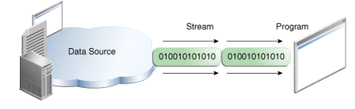
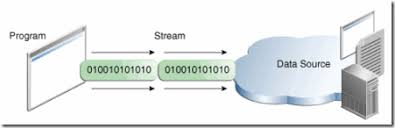
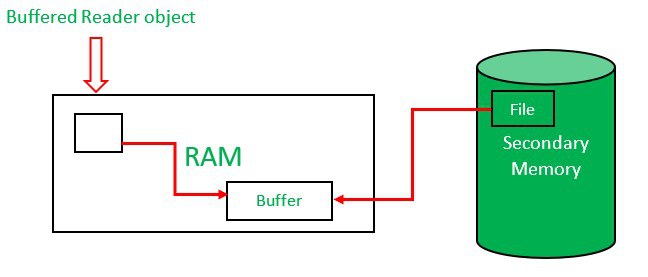
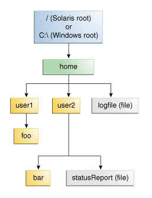
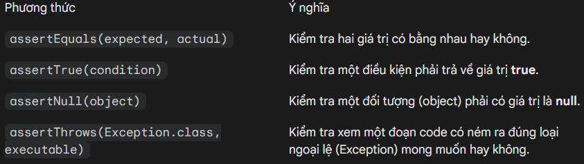

<center>

BUỔI 8: NHẬP XUẤT FILE, EXCEPTION, UNIT TEST
</center>

## Nội dung tài liệu
1. **Xử lý file trong Java**
- tổng quan về stream
- file trong java
- Character Stream và Byte Stream
- ObjectInputStream và ObjectOutputStream
- BufferReader và BufferWriter
- Đường dẫn? Đường dẫn tương đối và tuyệt đối?

2. **Exception**
- Exception là gì? Checked và Unchecked Exception? Error
- Cách bắt exception bằng try-catch
- finally?
- Cây phân cấp Exception? throw và throws?
- Tạo ra Exception của riêng mình

3. **Unit test**
- Unit test là gì? Các thư viện để test trong Java
- Assertions, viết Unit Test
- Một số quy tắc viết Test
- Chạy thử hàng loạt test và Test Coverage

## I. Xử lý file trong Java
**A. Tổng quan về stream**

**1. Stream là gì?**
- Stream hay còn gọi là Java IO có một nguyên tắc không đổi: **máy tính chỉ hiểu các bit 0 và 1**
- **Không có khái niệm image/video/audio/....** đó là dành cho con người

**Câu hỏi: Làm sao để máy tính và con người giao tiếp được với nhau ?**

Ví dụ:
- vanq: gõ code "printf("Hello World)"
- máy tính: chạy và hiển thị video đó (output)

-> **Bước 1:** Input ban đầu (raw) cần được biến đổi về dạng 0 và 1 (dạng A)
-> máy tính hiểu (READ)


-> **Bước 2:** dạng A (tại bước 1) cần biến đổi thành dạng B (image/video/audio/....)
-> Output cho con người hiểu (WRITE)


**Kết luận: Để thực hiện quá trình trên, chúng ta sử dụng "stream"**

Ví dụ: 100001000010000.....
- Thay vì xử lí tất cả data một lúc, chúng ta chia nhỏ thành các chunk
    - Chunk 1: 1000
    - Chunk 2: 1000
    - Chunk n: ....

**Ưu điểm:**
- Tiết kiệm tài nguyên máy tính. File càng lớn tốn càng nhiều tài nguyên
- Giảm thiểu thời gian tải qua mạng

**Nhược điểm:** Sử dụng nhiều thao tác IO

**II. File trong Java**
- Đọc và ghi file trong java là các hoạt động nhập/xuất dữ liệu (nhập dữ liệu từ bàn phím, đọc dữ liệu từ file, ghi dữ liệu lên màn hình, ghi ra file, ghi ra đĩa, ghi ra máy in…) đều được gọi là luồng (stream).
Một số lệnh thường dùng:
- `File`: Là thực thể dẫn tới file, hoặc thư mục, cho các hàm để làm việc với File
- `FileInputStream/FileOutputStream`: Đọc ghi file binary
- `FileReader/FileWriter`: Đọc ghi file văn bản
- `BufferedReader/BufferedWriter`: Đọc ghi file có Buffer

**III. Character Stream và Byte Stream**

**Ví dụ:** 
- Tiếng Anh 26 chữ cái có thể biểu diễn gói gọn trong 8 byte, tất cả các từ tiếng Anh đều có thể biểu diễn qua 26 chữ cái này.
- Tiếng Việt có 29 chữ cái và 5 dấu nên cần số lượng byte lớn hơn rất nhiều đễ biểu diễn

-> Byte Stream và Character Stream khác nhau ở việc biểu diễn kí tự trong thực tế.
A. **Byte Stream**
Byte Stream được sử dụng để xử lý dữ liệu thô (raw data). Nó đọc và ghi dữ liệu theo từng khối **8-bit (1 byte)**.
- **Đặc điểm**: Không quan tâm đến bảng mã (encoding). Nó vận chuyển các byte từ nguồn đến đích mà không thay đổi gì.
- **Sử dụng khi nào**: Khi bạn làm việc với các file không phải văn bản thuần túy như hình ảnh, âm thanh, video, file thực thi (.class, .exe), hoặc dữ liệu mạng.
- Lớp cơ sở:
  - **InputStream**: Lớp cha cho tất cả các luồng đọc byte.
  - **OutputStream**: Lớp cha cho tất cả các luồng ghi byte.

- Các lớp phổ biến: `FileInputStream`, `FileOutputStream`, `BufferedInputStream`.

1. **FileInputStream và FileOutputStream**
- Lớp FileInputStream trong java đọc được các byte từ một input file. Nó được sử dụng để đọc dữ liệu theo định dạng byte (các byte stream) như dữ liệu hình ảnh, âm thanh, video vv. Bạn cũng có thể đọc các dữ liệu có định dạng ký tự. Tuy nhiên, để đọc các dòng ký tự (các character stream), bạn nên sử dụng lớp FileReader.
- Lớp FileOutputStream là một output stream được sử dụng để ghi dữ liệu vào một file theo định dạng byte (byte stream). Sử dụng lớp FileOutputStream trong java, nếu bạn phải ghi các giá trị nguyên thủy vào một file. Bạn có thể ghi dữ liệu theo định dạng byte hoặc định dạng ký tự thông qua lớp FileOutputStream. Tuy nhiên, đối với các dữ liệu được ghi theo ký tự, sử dụng FileWriter thích hợp hơn FileOutStream.

**Ví dụ 1: Đọc và ghi lần lượt từng byte**
```java
import java.io.FileInputStream;
import java.io.FileOutputStream;
import java.io.IOException;

public class InOutStream {
    public static void main(String[] args) throws IOException {
        FileInputStream fis = new FileInputStream("E:\\MyCode\\JavaCore\\Thuc_hanh\\Test\\src\\input.txt");
        FileOutputStream fos = new FileOutputStream("E:\\MyCode\\JavaCore\\Thuc_hanh\\Test\\src\\output.txt");
        int i = -1;
        while ((i = fis.read()) != -1) {
            System.out.println((char) i);
            fos.write(i);
        }
        fis.close();
        fos.close();
    }
}
```

Kết quả thu được là file output.txt được tạo và có nội dung giống file input.txt. Trên màn hình console, có kí tự được in từng dòng một là do các byte được đọc 1 cách lần lượt.

**B. Character Stream**
- Luồng Character Stream, hay sử dụng các FileReader FileWriter thì đọc ghi 16-bit unicode, hỗ trợ được các ngôn ngữ đặc thù hơn (có dấu, gần thì tiếng Việt, các ngôn ngữ khác trên thế giới) do 16-bit unicode cho phép biểu diễn nhiều từ ngữ hơn
1. **Sử dụng FileReader và FileWriter**
- Lớp FileReader trong java được sử dụng để đọc các dữ liệu theo định dạng ký tự trong một file. Lớp FileWriter trong java được sử dụng để ghi các dữ liệu theo định dạng ký tự vào một file. Chúng ta nên sử dụng 2 lớp này khi thao tác với file ký tự.
- Do là Character Stream nên khi sử dụng 2 lớp này, chúng ta không cần chuyển đổi về mảng byte để đọc/ghi.

**Ví dụ:**
```java
import java.io.*;

public class Main {
    public static void main(String args[]) {
        FileReader in = null;
        FileWriter out = null;

        try {
            in = new FileReader("E:/input.txt");
            out = new FileWriter("E:/output.txt");

            int c;
            while ((c = in.read()) != -1) {
                out.write(c);
            }
        } catch (IOException e) {
            e.printStackTrace();
        } finally {
            try {
                if (in != null) {
                    in.close();
                }
                if (out != null) {
                    out.close();
                }
            } catch (IOException e) {
                e.printStackTrace();
            }

        }
    }
}
```

- Kết quả thu được là file output.txt có nội dung tương tự file input.txt.

## II. ObjectInputStream và ObjectOutputStream
- Trong Java, **ObjectInputStream** và ((ObjectOutputStream)) là hai lớp cao cấp thuộc Byte Stream, được sử dụng để thực hiện quá trình **Serialization** (Tuần tự hóa) và 8* (Giải tuần tự hóa) đối tượng.
- Nói đơn giản: Chúng giúp bạn "đóng gói" cả một đối tượng Java (với đầy đủ trạng thái và dữ liệu của nó) thành một chuỗi byte để lưu vào file hoặc gửi qua mạng, sau đó "hồi sinh" chuỗi byte đó trở lại thành đối tượng ban đầu.

1. **ObjectOutputStream (Serialization)**
Lớp này dùng để chuyển đổi một đối tượng Java sang dạng byte stream để ghi vào file hoặc truyền đi.
- Phương thức quan trọng: `writeObject(Object obj)`
- Điều kiện: Đối tượng muốn ghi phải triển khai (implement) interface java.io.Serializable. Đây là một "marker interface" (không có phương thức nào), chỉ dùng để báo với Java rằng: "Đối tượng này an toàn để đóng gói".

2. **ObjectInputStream (Deserialization)**
Lớp này thực hiện công việc ngược lại: đọc chuỗi byte từ nguồn (file, socket) và tái tạo lại đối tượng Java trong bộ nhớ.
- Phương thức quan trọng: `readObject()`
- Lưu ý: Phương thức này trả về kiểu `Object`, vì vậy bạn cần ép kiểu (cast) về lớp cụ thể của đối tượng đó.

**Ví dụ:**
```java
import java.io.Serializable;

// Phải có Serializable
public class User implements Serializable {
    private static final long serialVersionUID = 1L; // Đảm bảo phiên bản lớp đồng nhất
    String name;
    transient String password; // 'transient' sẽ ngăn không cho lưu trường này (vì bảo mật)

    public User(String name, String password) {
        this.name = name;
        this.password = password;
    }
}
```

## III. BufferReader và BufferWriter
1. **BufferReader**
- Với BufferReader thì thực tế ta sẽ cung cấp một bộ đệm ở giữa ở Ram, giúp truy cập nhanh hơn. Hiểu đơn giản kiểu: Ví dụ khi xem youtube thì sẽ tốn Ram hơn đọc báo, do xem video sẽ tốn tài nguyên ram lưu trữ hơn từng văn bản.



Lưu ý:
- **Tính năng nổi bật**: Phương thức `readLine()`. Đây là cách phổ biến nhất để đọc dữ liệu từ file theo từng dòng một.
- **Cấu trúc**: Nó thường bọc quanh một `FileReader`.

Ví dụ:
```java
try (BufferedReader br = new BufferedReader(new FileReader("data.txt"))) {
    String line;
    while ((line = br.readLine()) != null) {
        System.out.println(line);
    }
} catch (IOException e) {
    e.printStackTrace();
}
```

**2. BufferedWriter**
Dùng để ghi văn bản vào một character-output stream, giúp giảm số lần hệ thống phải truy cập trực tiếp vào ổ cứng.

- **Tính năng nổi bật**: Phương thức newLine(). Nó tự động thêm một ký tự xuống dòng phù hợp với hệ điều hành đang chạy (Windows dùng \r\n, Linux dùng \n).

- **Cơ chế**: Dữ liệu sẽ được tích trữ trong bộ nhớ đệm. Khi bộ đệm đầy hoặc bạn gọi lệnh flush(), dữ liệu mới thực sự được đẩy xuống file.

Ví dụ:
```java
try (BufferedWriter bw = new BufferedWriter(new FileWriter("output.txt"))) {
    bw.write("Chào mừng bạn đến với Java I/O!");
    bw.newLine(); // Xuống dòng thông minh
    bw.write("Dòng thứ hai.");
} catch (IOException e) {
    e.printStackTrace();
}
```

## IV. Đường dẫn? Đường dẫn tương đối và tuyệt đối?
1. **Đường dẫn (Path) là gì?**
Hầu hết các hệ thống tập tin được sử dụng ngày hôm nay lưu trữ các tập tin trong một cây (hoặc cấu trúc phân cấp). Ở đầu cây là một (hoặc nhiều hơn) các nút gốc. Dưới nút gốc, có các tệp và thư mục (thư mục trong Microsoft Windows). Mỗi thư mục có thể chứa các tệp tin và các thư mục con, do đó có thể chứa các tệp và thư mục con, v.v … có khả năng lưu trữ một chiều sâu gần như vô hạn.


2. **Đường dẫn tương đối/tuyệt đối**
- Một đường dẫn tuyệt đối luôn chứa các phần tử gốc và danh sách thư mục đầy đủ cần thiết để định vị tệp tin. Ví dụ, D:/file.txt là một đường dẫn tuyệt đối. Tất cả thông tin cần thiết để định vị tệp tin được chứa trong chuỗi đường dẫn.

- Một đường dẫn tương đối cần phải được kết hợp với một đường dẫn khác để truy cập một tập tin. Ví dụ là đây là đường dẫn tới file xuất phát từ file dự án

**3. Ý nghĩa**
- Đường dẫn tuyệt đối thì ví dụ khi mang file sang nơi khác để chạy thì có thể sẽ không chạy được, vì có thể do máy người khác dùng một cách sắp thư mục khác (window vs linux), hoặc code thì dùng ổ D:/ mà máy người dùng không có ổ này, …
- Đường dẫn tương đối sẽ được ưa dùng hơn, tức là ta sẽ lưu file nằm gọn trong cùng thư mục dự án, và khi đóng gói thì các thao tác chỉ nằm trong khu vực của dự án

## V. Exception
1. Cây phân cấp Exception
- `Error`: Những vấn đề nghiêm trọng hệ thống (hết bộ nhớ `OutOfMemoryError`, lỗi máy ảo `StackOverflowError`). Bạn thường không nên và không thể "bắt" được `Error` bằng code.
- `Exception`: Những tình huống mà chương trình có thể xử lý. Chia làm 2 loại chính:
    - **Checked Exception**: Các lỗi xảy ra tại thời điểm Compile-time (lúc biên dịch). Java ép bạn phải xử lý chúng (ví dụ: `IOException`, `SQLException`).
    - **Unchecked Exception (RuntimeException)**: Các lỗi xảy ra tại thời điểm Runtime (lúc chạy). Java không bắt buộc bạn phải xử lý, thường do lỗi logic của lập trình viên (ví dụ: `NullPointerException`, `ArrayIndexOutOfBoundsException`).

**2. Cách bắt Exception bằng try-catch**
Để xử lý ngoại lệ, chúng ta dùng khối lệnh `try-catch`.
```java
try {
    // Code có khả năng gây ra ngoại lệ
    int result = 10 / 0; 
} catch (ArithmeticException e) {
    // Code xử lý khi ngoại lệ xảy ra
    System.out.println("Không thể chia cho 0: " + e.getMessage());
} catch (Exception e) {
    // Catch-all: bắt tất cả các loại exception còn lại
    System.out.println("Có lỗi xảy ra!");
}
```

3. Khối lệnh `finally`
Khối `finally` luôn luôn được thực thi, bất kể có ngoại lệ xảy ra hay không. Nó thường được dùng để dọn dẹp tài nguyên (đóng file, đóng kết nối database).
```java
try {
    // Mở file
} catch (IOException e) {
    // Xử lý lỗi đọc file
} finally {
    // Luôn đóng file ở đây để tránh rò rỉ bộ nhớ
}
```

4. Phân biệt `throw` và `throws`
Hai từ khóa này rất dễ nhầm lẫn nhưng mục đích khác hẳn nhau:

| Đặc điểm | `throw`                                      | `throws`                                                 |
| -------- | -------------------------------------------- | -------------------------------------------------------- |
| Vị trí   | Nằm trong thân phương thức.                  | Nằm ở tên phương thức (method signature).                |
| Mục đích | Dùng để chủ động ném ra một ngoại lệ cụ thể. | Thông báo rằng phương thức này có thể ném ra ngoại lệ.   |
| Số lượng | Chỉ ném 1 đối tượng ngoại lệ.                | Có thể khai báo nhiều ngoại lệ (cách nhau bởi dấu phẩy). |

Ví dụ:
```java
public void checkAge(int age) throws ArithmeticException { // Khai báo
    if (age < 18) {
        throw new ArithmeticException("Chưa đủ tuổi!"); // Chủ động ném
    }
}
```

**5. Tạo Exception của riêng mình (Custom Exception)**
Đôi khi các Exception có sẵn của Java không mô tả đúng nghiệp vụ của bạn (ví dụ: `SoDuKhongDuException`). Bạn có thể tự tạo bằng cách kế thừa lớp `Exception`.
```java
// 1. Tạo class kế thừa Exception (Checked) hoặc RuntimeException (Unchecked)
class InvalidAgeException extends Exception {
    public InvalidAgeException(String message) {
        super(message);
    }
}

// 2. Sử dụng
public class Test {
    public static void validate(int age) throws InvalidAgeException {
        if (age < 0) throw new InvalidAgeException("Tuổi không thể âm!");
    }
}
```

## VI. Unit Test
**1. Unit test là gì?**
- **Đơn vị (Unit)**: Là phần nhỏ nhất của code có thể thực thi được (ví dụ: một hàm tính tổng).
- **Mục tiêu**: Phát hiện lỗi sớm ngay từ khâu lập trình, đảm bảo code chạy đúng sau khi nâng cấp hoặc sửa đổi (Refactoring).
- **Tính chất**: Chạy cực nhanh, độc lập (không kết nối database thật, không gọi API thật).

2. **Các thư viện để test trong Java**
- Sẽ cài đặt 2 thư viện hỗ trợ trong việc kiểm thử unit test
  - JUnit (https://mvnrepository.com/artifact/junit/junit)
  - JUnit Jupiter API (https://mvnrepository.com/artifact/org.junit.jupiter/junit-jupiter-api)

**3. Assertions, viết Unit Test**
- **Assertions (Khẳng định)** là trái tim của Unit Test. Nó so sánh kết quả thực tế (`actual`) với kết quả kỳ vọng (`expected`). Nếu hai giá trị khác nhau, test sẽ thất bại (Fail).

Giả sử ta có lớp `Calculator`:
```java
import org.junit.jupiter.api.Test;
import static org.junit.jupiter.api.Assertions.*;

class CalculatorTest {
    
    @Test
    void testAdd() {
        Calculator calc = new Calculator();
        int result = calc.add(2, 3);
        
        // Assertions phổ biến
        assertEquals(5, result, "2 + 3 phải bằng 5");
        assertTrue(result > 0);
        assertNotNull(calc);
    }
}
```



**4. Một số quy tắc viết Test (FIRST)**
- **Fast (Nhanh)**: Các bài test phải chạy trong vài mili giây.
- **Independent (Độc lập)**: Test này không được phụ thuộc vào kết quả của test kia.
- **Repeatable (Có thể lặp lại)**: Chạy 100 lần trên 100 máy khác nhau phải ra cùng một kết quả.
- **Self-Validating (Tự xác thực)**: Test chỉ có 2 trạng thái: Pass hoặc Fail, không cần người vào đọc log để đoán.
- **Timely (Kịp thời)**: Nên viết test song song hoặc trước khi viết code nghiệp vụ (TDD).

**5. Chạy hàng loạt Test & Test Coverage**
**Chạy hàng loạt (Test Suite)**
- **Maven**: Chạy lệnh `mvn test`.
- **Gradle**: Chạy lệnh `./gradlew test`. Các công cụ này sẽ quét toàn bộ dự án và thực hiện tất cả các phương thức có gắn thẻ @`Test`.

**Test Coverage (Độ bao phủ)**
Test Coverage là chỉ số đo lường xem có bao nhiêu % mã nguồn của bạn đã được các Unit Test thực thi qua.

- Công cụ phổ biến: **JaCoCo** (Java Code Coverage).

- Chỉ số lý tưởng: Thường dao động từ **70% - 90%**. Tuy nhiên, 100% coverage không có nghĩa là code không có bug, nó chỉ có nghĩa là mọi dòng code đã được "chạy qua" ít nhất một lần trong lúc test.