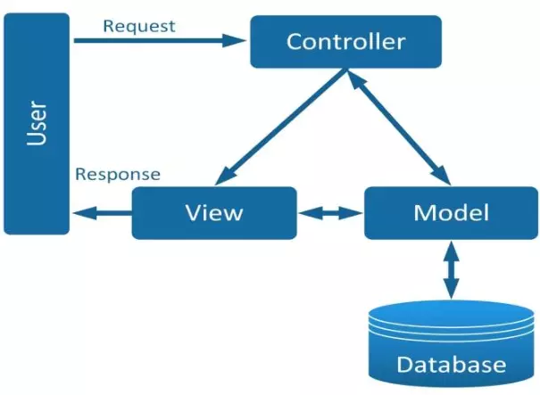

<center>

Buổi 9: Software Design nhập môn
</center>

## Nội dung tài liệu
1. **SOLID là gì? (3 phần đầu)**
2. **KISS, DRY, YAGNI**
3. **Mô hình MVC**
4. **Các thành phần chính trong lập trình giao diện**

## I. SOLID là gì ?
- **SOLID** là một tập hợp **5 nguyên tắc thiết kế phần mềm cơ bản** trong lập trình hướng đối tượng (OOP), tên gọi **"SOLID"** là viết tắt của 5 chữ cái đầu trong tên 5 nguyên tắc này, giúp lập trình viên viết ra mã nguồn **dễ đọc, dễ hiểu, dễ bảo trì, mở rộng và tái sử dụng**. 

### 1. Single responsibility priciple
- Nguyên lý đầu tiên ứng với chữ S trong SOLID, có ý nghĩa là một class chỉ nên giữ một trách nhiệm duy nhất. 
- Một class có quá nhiều chức năng sẽ trở nên cồng kềnh và trở nên khó đọc, khó maintain.
```java
class Student {
    public static void getDetails() { /* ... */ }
    public static void saveToDatabase() { /* Lưu vào DB */ } // Sai: Việc của DB không phải của Student
    public static void printReport() { /* In báo cáo */ }    // Sai: Việc của UI/Printer
};
```

- Tuân thủ: Tách ra thành các class riêng biệt.
    - `Student`: Chỉ giữ dữ liệu.

    - `StudentRepository`: Chuyên lưu trữ.

    - `StudentPrinter`: Chuyên hiển thị.


### 2. Open/Closed principle
- Nguyên lý thứ 2 ứng với chữ `O` trong `SOLID`. Nội dung **Có thể thoải mái mở rộng 1 class nhưng không được sửa đổi bên trong class đó** (open for extension but closed for modification)
```java
float calculateArea(string shapeType, float logic) {
    if (shapeType == "Square") return logic * logic;
    if (shapeType == "Circle") return 3.14 * logic * logic;
    // Phải sửa code cũ mỗi khi thêm hình mới -> Vi phạm OCP
}
```

- Tuân thủ: Sử dụng tính đa hình (Polymorphism). Khi thêm hình mới, chỉ cần tạo class mới kế thừa từ Shape.

### 3. Liskov substitution principle

- "Các đối tượng của lớp con phải có khả năng thay thế các đối tượng của lớp cha mà không làm thay đổi tính đúng đắn của chương trình."
- Nếu bạn có một lớp cha là `Chim` và lớp con là `Đà điểu`, nhưng lớp cha có phương thức `Bay()`, thì `Đà điểu` sẽ vi phạm nguyên tắc này vì **đà điểu không bay được**. Thiết kế đúng sẽ là tách riêng các khả năng ra để lớp con luôn thực hiện được mọi thứ lớp cha có.

## II. KISS, DRY, YAGNI
### 1. KISS
- KISS - Keep It Simple, Stupid!
Nguyên tắc này khuyên rằng đừng cố gắng "thể hiện" bằng những thuật toán quá phức tạp hay những dòng code lồng chéo nhau nếu có cách giải quyết đơn giản hơn.
- **Ý nghĩa**: Code đơn giản thì dễ đọc, dễ debug và ít lỗi hơn.

### 2. DRY
- DRY: “Don’t Repeat Yourself” – Đừng bao giờ lặp lại code.
- Ví dụ:

```java
public void print(User user) {
  System.out.println("first name: "+user.getFirstName());
  System.out.println("last name: "+user.getLastName());
  System.out.println("age: "+user.getAge());
  System.out.println("email: "+user.getEmail());
  System.out.println("address: "+user.getAddress());
  System.out.println("gender: "+user.getGender());
  System.out.println("exprience: "+user.getExperience());
  
  // do something: print user info
}
public void preview(User user) {
  System.out.println("first name: "+user.getFirstName());
  System.out.println("last name: "+user.getLastName());
  System.out.println("age: "+user.getAge());
  System.out.println("email: "+user.getEmail());
  System.out.println("address: "+user.getAddress());
  System.out.println("gender: "+user.getGender());
  System.out.println("exprience: "+user.getExperience());
  
  // do something: review user
}
```

2 method trên thực hiện 2 chức năng khác nhau nhưng có rất nhiều code bị lặp lại, đây là case bị lặp code cơ bản ít người mắc phải. Ta có thể tránh lặp code trường hợp này bằng cách tách phần in thông tin user ra thành 1 method và gọi tới nó:

```java
public void showUser(User user) {
  System.out.println("first name: "+user.getFirstName());
  System.out.println("last name: "+user.getLastName());
  System.out.println("age: "+user.getAge());
  System.out.println("email: "+user.getEmail());
  System.out.println("address: "+user.getAddress());
  System.out.println("gender: "+user.getGender());
  System.out.println("exprience: "+user.getExperience());
}
public void print(User user) {
  showUser(user);
  // do something: print user info
}
public void preview(User user) {
  showUser(user);
  // do something: review user
}
```

### 3. YAGNI
- YAGNI: “You Aren’t Gonna Need It”: Bạn không cần nó.
- Đôi khi bạn nghĩ rằng cần phải thêm 1 số chức năng mới, bạn nghĩ nó cần thiết, có thể sẽ dùng trong tương lai và bạn làm nó. Stop, hãy dừng lại, như thế là bạn đang phạm phải sai lầm.
- Bạn không nên lãng phí thời gian vì hành động đó, cái chức năng mà bạn thêm mới đó có thể không làm ưng ý khách hàng hoặc cấp trên, thậm chí không bao giờ được dùng tới. Hãy confirm nó trước khi làm, và tập trung vào các task hiện tại thay vì đi làm 1 cái mới mà chưa chắc đã dùng tới rồi lại phải mất thêm công test nó.

## III. Mô hình MVC
### 1. Kiến thức nền tảng
**1.1 Tìm hiểu mô hình MVC là gì?**
- **MVC** là viết tắt của cụm từ **“Model-View-Controller“**.
- Đây là mô hình thiết kế được sử dụng trong kỹ thuật phần mềm.
- MVC là một mẫu kiến trúc phần mềm để tạo lập giao diện người dùng trên máy tính.
- MVC chia thành ba phần được kết nối với nhau và mỗi thành phần đều có một nhiệm vụ riêng của nó và độc lập với các thành phần khác.
- MVC cũng được sử dụng rộng rãi trong phát triển web, sự khác biệt được tùy chỉnh liên quan đến sự có mặt của server - client.



**1.2 Các thành phần trong MVC**
**Model**
- Có nhiệm vụ thao tác với **Database**
- Nó chứa **tất cả các hàm, các phương thức truy vấn** trực tiếp với dữ liệu
- **Controller** sẽ thông qua các hàm, phương thức đó để **lấy dữ liệu rồi gửi qua View**

**View**
- Là giao diện người dùng (User Interface)
- Chứa các thành phần tương tác với người dùng như menu, button, image, text,...
- Nơi nhận dữ liệu từ Controller và hiển thị

**Controller**
- Là thành phần **trung gian** giữa **Model** và **View**
- Đảm nhận vai trò tiếp nhận yêu cầu từ người dùng, thông qua **Model** để **lấy dữ liệu** sau đó thông qua **View** để **hiển thị** cho người dùng

**1.3 Tại sao nên sử dụng mô hình MVC**
1. Sự độc lập và phát triển song song
- Vì mỗi thành phần trong MVC có nhiệm vụ riêng và độc lập với nhau, nên mỗi developer có thể đảm nhiệm một thành phần và không ảnh hưởng đến nhau khiến quá trình phát triển diễn ra nhanh chóng, dễ dàng

2. Hỗ trợ bất đồng bộ
- Kỹ thuật bất đồng bộ khiến các ứng dụng được load nhanh hơn đơn giản vì tiến hành chạy nhiều câu lệnh cùng lúc

## IV. Các thành phần chính trong lập trình giao diện
### 1. Thành phần hình ảnh (UI Components / Widgets)
Đây là những thứ người dùng trực tiếp nhìn thấy và tương tác. Chúng là những "viên gạch" xây dựng nên giao diện.
- **Cơ bản**: Button (nút bấm), Text Field (ô nhập liệu), Label (nhãn văn bản), Checkbox, Radio Button.
- **Phức tạp**: Layout (khung bố cục), List View (danh sách cuộn), Modal/Dialog (hộp thoại thông báo), Navigation Bar (thanh điều hướng).

### 2. Bố cục (Layout Management)
Lập trình giao diện không chỉ là ném các nút bấm lên màn hình mà phải sắp xếp chúng sao cho khoa học và phản hồi tốt (Responsive) trên nhiều kích cỡ màn hình khác nhau.
- **Box Model**: Cách xác định khoảng cách giữa các phần tử (Margin, Padding, Border).
- **Hệ thống lưới (Grid/Flexbox)**: Giúp căn chỉnh các thành phần theo hàng và cột.
- **Trình quản lý bố cục (Layout Managers)**: Trong các framework như Qt (C++) hay Swing (Java), bạn sẽ gặp các khái niệm như QVBoxLayout (xếp dọc) hay QHBoxLayout (xếp ngang).

### 3. Quản lý sự kiện (Event Handling)
Giao diện sẽ là "chết" nếu không có phản hồi. Thành phần này xử lý các hành động của người dùng.
- **Sự kiện**: Click chuột, gõ phím, vuốt màn hình (swipe), thay đổi kích thước cửa sổ.
- **Cơ chế**: Thường sử dụng các hàm gọi lại (Callback functions) hoặc các cơ chế như Signal & Slot (rất phổ biến trong C++/Qt). Khi người dùng bấm nút, một "sự kiện" được gửi đi và code xử lý logic sẽ được kích hoạt.

### 4. Trạng thái và Dữ liệu (State Management)
Đây là "bộ não" của giao diện. Trạng thái quyết định những gì hiển thị tại một thời điểm nhất định.
- Ví dụ: Khi bạn bấm vào nút "Đang tải", trạng thái của nút chuyển từ "Bình thường" sang "Loading" (hiệu ứng quay tròn).
- **Đồng bộ dữ liệu**: Đảm bảo khi dữ liệu trong bộ nhớ thay đổi (ví dụ: số dư tài khoản tăng lên), giao diện phải tự động cập nhật số con số mới mà không cần tải lại toàn bộ trang.